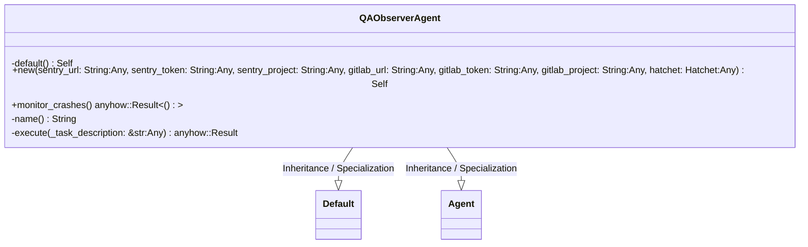
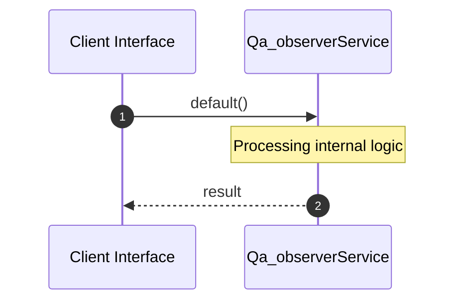

# File: qa_observer.rs

**Source Path:** `crates/factory-application/src/agents/qa_observer.rs`

## Overview

### Purpose
Provides implementation for qa_observer.rs.

### Responsibilities
* Handles logic related to qa_observer.

### Dependencies
* uuid::Uuid, async_trait::async_trait, serde_json::Value, crate::Agent, factory_infrastructure::{GitlabClient, HttpGitlabClient, HttpSentryClient, SentryClient}, std::time::Duration, crate::workflows::autonomous_mission::MissionInput, hatchet_sdk::{Hatchet, Runnable}

## Public API & Architecture

### Exported Classes / Structs / Interfaces

#### QAObserverAgent

**Overview:** Represents QAObserverAgent.

**Public Methods:**

##### `new(sentry_url: String (Any), sentry_token: String (Any), sentry_project: String (Any), gitlab_url: String (Any), gitlab_token: String (Any), gitlab_project: String (Any), hatchet: Hatchet (Any)) -> Self`
Executes new.

##### `monitor_crashes() -> anyhow::Result<()>`
Executes monitor_crashes.

### Exported Functions

None.

## Internal Architecture & Execution Flow

### Sequence Explanation

## Cross References
* **Parent module:** `crates/factory-application/src/agents`
* **Dependencies:** uuid::Uuid, async_trait::async_trait, serde_json::Value, crate::Agent, factory_infrastructure::{GitlabClient, HttpGitlabClient, HttpSentryClient, SentryClient}, std::time::Duration, crate::workflows::autonomous_mission::MissionInput, hatchet_sdk::{Hatchet, Runnable}
