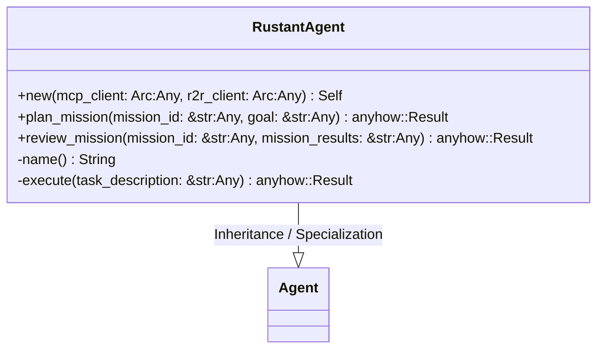
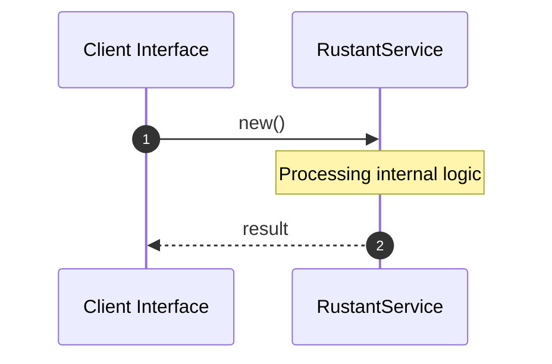

# File: rustant.rs

**Source Path:** `crates/factory-application/src/agents/rustant.rs`

## Overview

### Purpose
Provides implementation for rustant.rs.

### Responsibilities
* Handles logic related to rustant.

### Dependencies
* crate::Agent, async_trait::async_trait, std::sync::Arc, serde_json::{Value, json}, factory_infrastructure::{McpClient, R2rClient}

## Public API & Architecture

### Exported Classes / Structs / Interfaces

#### RustantAgent

**Overview:** Represents RustantAgent.

**Public Methods:**

##### `new(mcp_client: Arc<dyn McpClient> (Any), r2r_client: Arc<dyn R2rClient> (Any)) -> Self`
Executes new.

##### `plan_mission(mission_id: &str (Any), goal: &str (Any)) -> anyhow::Result<Value>`
Executes plan_mission.

##### `review_mission(mission_id: &str (Any), mission_results: &str (Any)) -> anyhow::Result<Value>`
Executes review_mission.

### Exported Functions

None.

## Internal Architecture & Execution Flow

### Sequence Explanation

## Cross References
* **Parent module:** `crates/factory-application/src/agents`
* **Dependencies:** crate::Agent, async_trait::async_trait, std::sync::Arc, serde_json::{Value, json}, factory_infrastructure::{McpClient, R2rClient}
