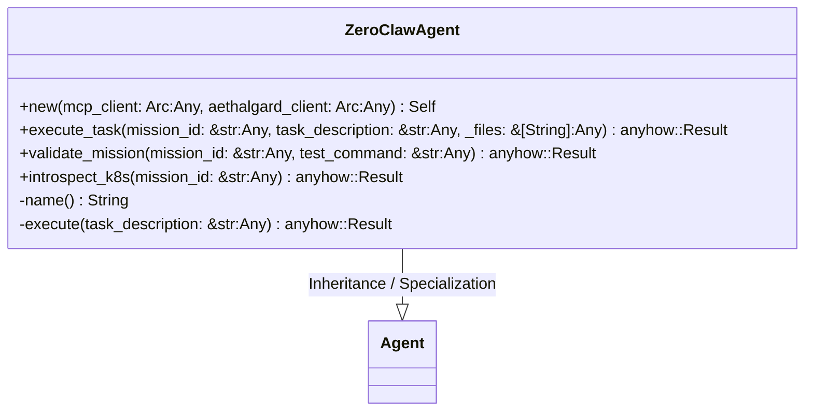
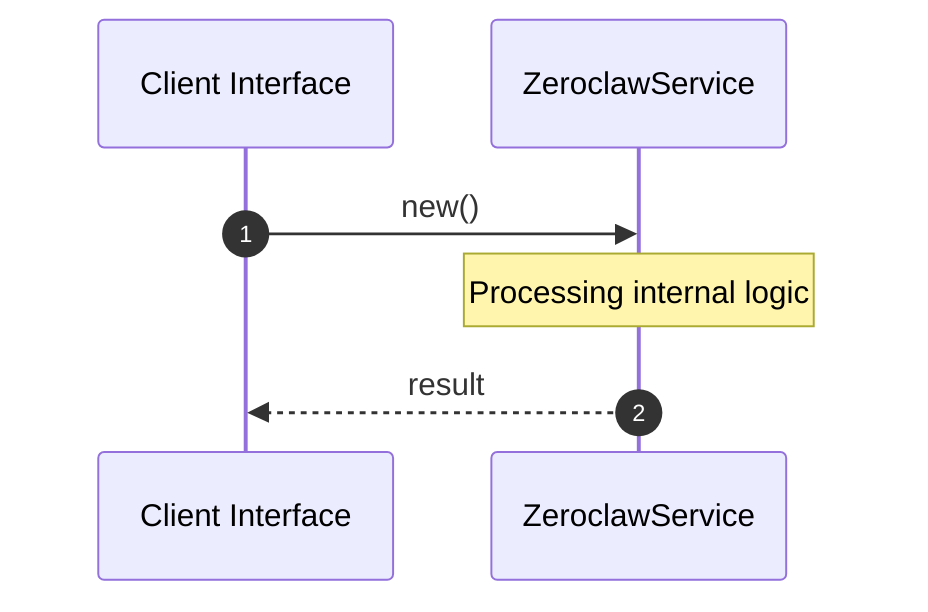

# File: zeroclaw.rs

**Source Path:** `crates/factory-application/src/agents/zeroclaw.rs`

## Overview

### Purpose
Provides implementation for zeroclaw.rs.

### Responsibilities
* Handles logic related to zeroclaw.

### Dependencies
* async_trait::async_trait, std::sync::Arc, crate::Agent, factory_infrastructure::{AethalgardClient, McpClient}, serde_json::{Value, json}

## Public API & Architecture

### Exported Classes / Structs / Interfaces

#### ZeroClawAgent

**Overview:** Represents ZeroClawAgent.

**Public Methods:**

##### `new(mcp_client: Arc<dyn McpClient> (Any), aethalgard_client: Arc<dyn AethalgardClient> (Any)) -> Self`
Executes new.

##### `execute_task(mission_id: &str (Any), task_description: &str (Any), _files: &[String] (Any)) -> anyhow::Result<Value>`
Executes execute_task.

##### `validate_mission(mission_id: &str (Any), test_command: &str (Any)) -> anyhow::Result<Value>`
Executes validate_mission.

##### `introspect_k8s(mission_id: &str (Any)) -> anyhow::Result<Value>`
Executes introspect_k8s.

### Exported Functions

None.

## Internal Architecture & Execution Flow

### Sequence Explanation

## Cross References
* **Parent module:** `crates/factory-application/src/agents`
* **Dependencies:** async_trait::async_trait, std::sync::Arc, crate::Agent, factory_infrastructure::{AethalgardClient, McpClient}, serde_json::{Value, json}
