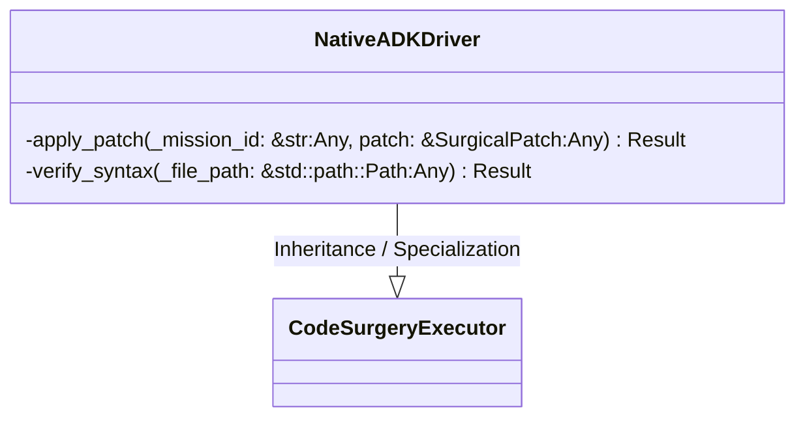
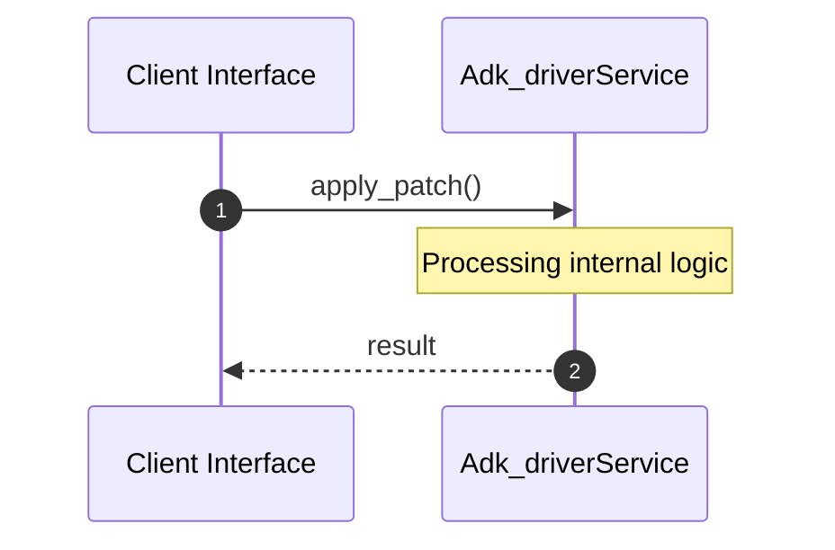

# File: adk_driver.rs

**Source Path:** `crates/factory-application/src/bridge/adk_driver.rs`

## Overview

### Purpose
Provides implementation for adk_driver.rs.

### Responsibilities
* Handles logic related to adk_driver.

### Dependencies
* async_trait::async_trait, std::fs, factory_core::error::FactoryError, factory_core::executor::{CodeSurgeryExecutor, ExecutionResult, SurgicalPatch}

## Public API & Architecture

### Exported Classes / Structs / Interfaces

#### NativeADKDriver

**Overview:** Represents NativeADKDriver.

**Public Methods:**

None.

### Exported Functions

None.

## Internal Architecture & Execution Flow

### Sequence Explanation

## Cross References
* **Parent module:** `crates/factory-application/src/bridge`
* **Dependencies:** async_trait::async_trait, std::fs, factory_core::error::FactoryError, factory_core::executor::{CodeSurgeryExecutor, ExecutionResult, SurgicalPatch}
