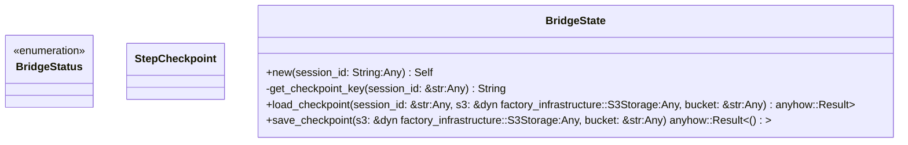
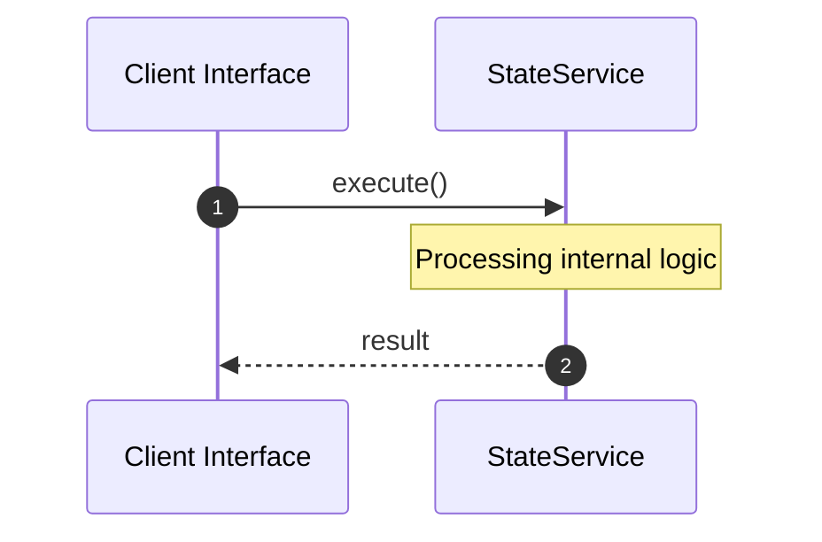

# File: state.rs

**Source Path:** `crates/factory-application/src/bridge/state.rs`

## Overview

### Purpose
Provides implementation for state.rs.

### Responsibilities
* Handles logic related to state.

### Dependencies
* serde::{Deserialize, Serialize}, chrono::{DateTime, Utc}, std::collections::HashMap

## Public API & Architecture

### Exported Classes / Structs / Interfaces

#### BridgeStatus

**Overview:** Represents BridgeStatus.

**Public Methods:**

None.

#### StepCheckpoint

**Overview:** Represents StepCheckpoint.

**Public Methods:**

None.

#### BridgeState

**Overview:** Represents BridgeState.

**Public Methods:**

##### `new(session_id: String (Any)) -> Self`
Executes new.

##### `load_checkpoint(session_id: &str (Any), s3: &dyn factory_infrastructure::S3Storage (Any), bucket: &str (Any)) -> anyhow::Result<Option<Self>>`
Executes load_checkpoint.

##### `save_checkpoint(s3: &dyn factory_infrastructure::S3Storage (Any), bucket: &str (Any)) -> anyhow::Result<()>`
Executes save_checkpoint.

### Exported Functions

None.

## Internal Architecture & Execution Flow

### Sequence Explanation

## Cross References
* **Parent module:** `crates/factory-application/src/bridge`
* **Dependencies:** serde::{Deserialize, Serialize}, chrono::{DateTime, Utc}, std::collections::HashMap
