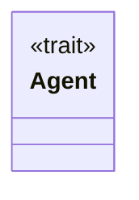
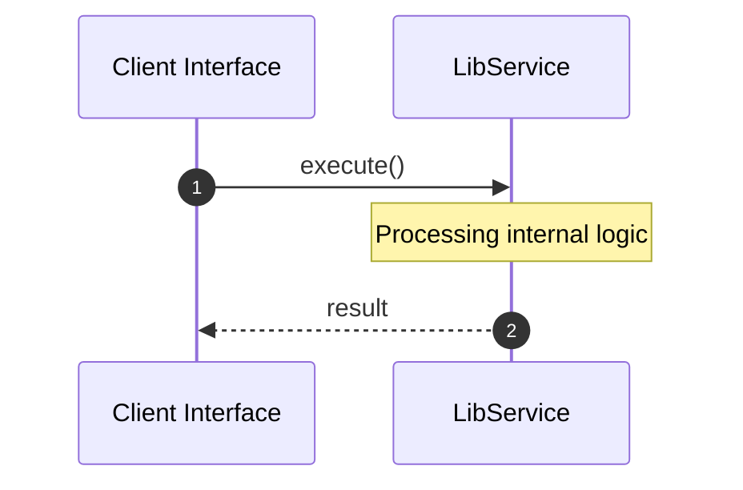

# File: lib.rs

**Source Path:** `crates/factory-application/src/lib.rs`

## Overview

### Purpose
Provides implementation for lib.rs.

### Responsibilities
* Handles logic related to lib.

### Dependencies
* serde_json::Value, async_trait::async_trait

## Public API & Architecture

### Exported Classes / Structs / Interfaces

#### Agent

**Overview:** Represents Agent.

**Public Methods:**

None.

### Exported Functions

None.

## Internal Architecture & Execution Flow

### Sequence Explanation

## Cross References
* **Parent module:** `crates/factory-application/src`
* **Dependencies:** serde_json::Value, async_trait::async_trait
