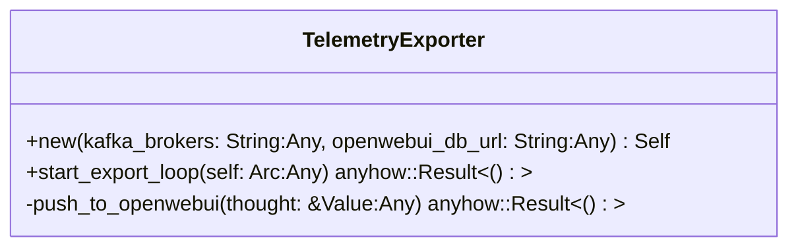
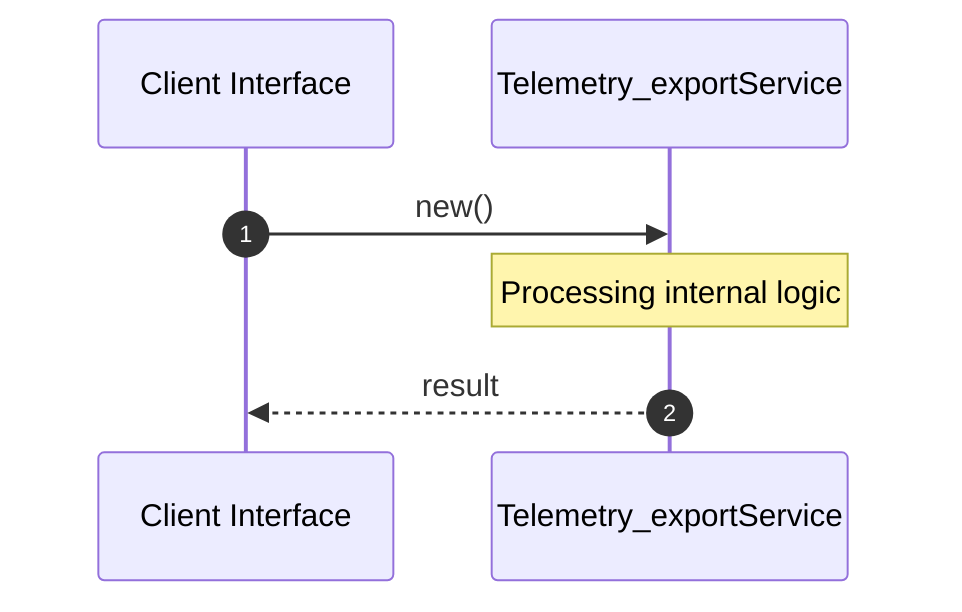

# File: telemetry_export.rs

**Source Path:** `crates/factory-application/src/telemetry_export.rs`

## Overview

### Purpose
Provides implementation for telemetry_export.rs.

### Responsibilities
* Handles logic related to telemetry_export.

### Dependencies
* reqwest::Client, serde_json::Value, std::sync::Arc, rdkafka::Message, rdkafka::consumer::{Consumer, StreamConsumer}

## Public API & Architecture

### Exported Classes / Structs / Interfaces

#### TelemetryExporter

**Overview:** Represents TelemetryExporter.

**Public Methods:**

##### `new(kafka_brokers: String (Any), openwebui_db_url: String (Any)) -> Self`
Executes new.

##### `start_export_loop(self: Arc<Self> (Any)) -> anyhow::Result<()>`
/// Starts a background task consuming `agent-thought` from Kafka and exporting to OpenWebUI.

### Exported Functions

None.

## Internal Architecture & Execution Flow

### Sequence Explanation

## Cross References
* **Parent module:** `crates/factory-application/src`
* **Dependencies:** reqwest::Client, serde_json::Value, std::sync::Arc, rdkafka::Message, rdkafka::consumer::{Consumer, StreamConsumer}
