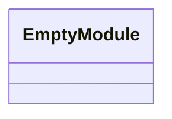
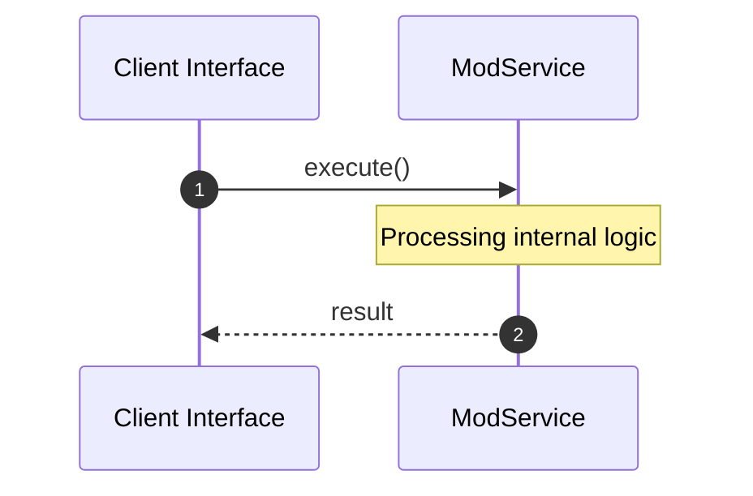

# File: mod.rs

**Source Path:** `crates/factory-application/src/utils/mod.rs`

## Overview

### Purpose
Provides implementation for mod.rs.

### Responsibilities
* Handles logic related to mod.

### Dependencies
* None

## Public API & Architecture

### Exported Classes / Structs / Interfaces

### Exported Functions

None.

## Internal Architecture & Execution Flow

### Sequence Explanation

## Cross References
* **Parent module:** `crates/factory-application/src/utils`
* **Dependencies:** None
