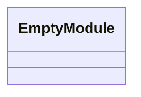
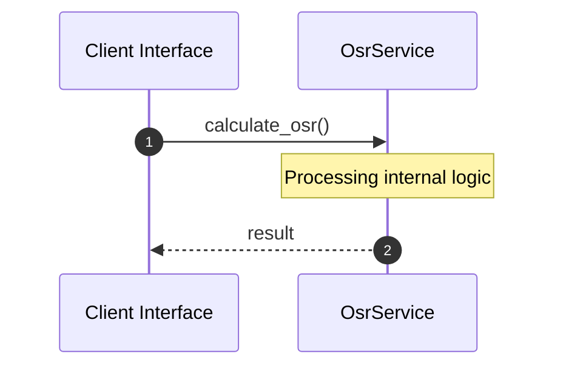

# File: osr.rs

**Source Path:** `crates/factory-application/src/utils/osr.rs`

## Overview

### Purpose
Provides implementation for osr.rs.

### Responsibilities
* Handles logic related to osr.

### Dependencies
* super::*

## Public API & Architecture

### Exported Classes / Structs / Interfaces

### Exported Functions

#### `calculate_osr(wiki_content: &str (Any), r2r_text: &str (Any)) -> f32`
Executes calculate_osr.

#### `levenshtein_distance(a: &str (Any), b: &str (Any)) -> usize`
Executes levenshtein_distance.

## Internal Architecture & Execution Flow

### Sequence Explanation

## Cross References
* **Parent module:** `crates/factory-application/src/utils`
* **Dependencies:** super::*
