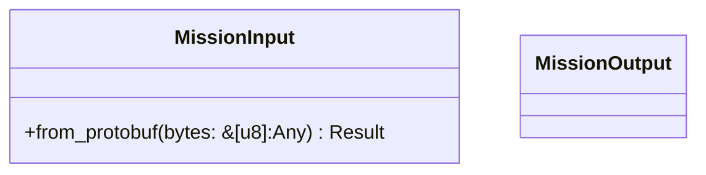
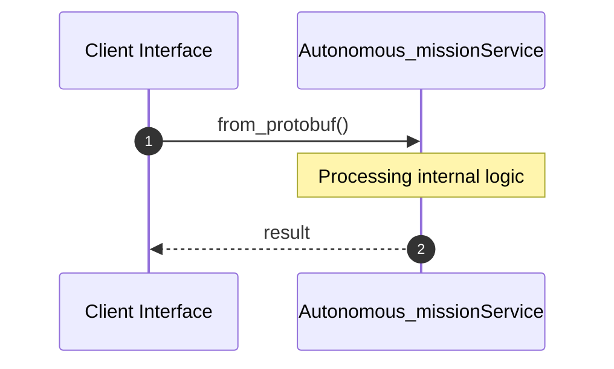

# File: autonomous_mission.rs

**Source Path:** `crates/factory-application/src/workflows/autonomous_mission.rs`

## Overview

### Purpose
Provides implementation for autonomous_mission.rs.

### Responsibilities
* Handles logic related to autonomous_mission.

### Dependencies
* serde::{Deserialize, Serialize}, hatchet_sdk::runnables::Workflow, factory_core::proto::v1::MissionInput as ProtoInput, std::sync::Arc, factory_infrastructure::{
    HttpR2rClient, KafkaClient, McpClient, McpHttpClient, R2rClient,
    aethalgard::{AethalgardClient, HttpAethalgardClient},
}, hatchet_sdk::Hatchet, super::*, crate::agents::{AuditorAgent, FinOpsAgent, RustantAgent, ZeroClawAgent}, uuid::Uuid, prost::Message

## Public API & Architecture

### Exported Classes / Structs / Interfaces

#### MissionInput

**Overview:** Represents MissionInput.

**Public Methods:**

##### `from_protobuf(bytes: &[u8] (Any)) -> Result<Self, prost::DecodeError>`
Executes from_protobuf.

#### MissionOutput

**Overview:** Represents MissionOutput.

**Public Methods:**

None.

### Exported Functions

#### `create_mission_workflow(hatchet: &Hatchet (Any), mcp_url: String (Any), r2r_url: String (Any), kafka_brokers: String (Any), aethalgard_webhook_url: String (Any)) -> Workflow<MissionInput, MissionOutput>`
Executes create_mission_workflow.

## Internal Architecture & Execution Flow

### Sequence Explanation

## Cross References
* **Parent module:** `crates/factory-application/src/workflows`
* **Dependencies:** serde::{Deserialize, Serialize}, hatchet_sdk::runnables::Workflow, factory_core::proto::v1::MissionInput as ProtoInput, std::sync::Arc, factory_infrastructure::{
    HttpR2rClient, KafkaClient, McpClient, McpHttpClient, R2rClient,
    aethalgard::{AethalgardClient, HttpAethalgardClient},
}, hatchet_sdk::Hatchet, super::*, crate::agents::{AuditorAgent, FinOpsAgent, RustantAgent, ZeroClawAgent}, uuid::Uuid, prost::Message
