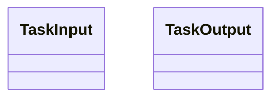
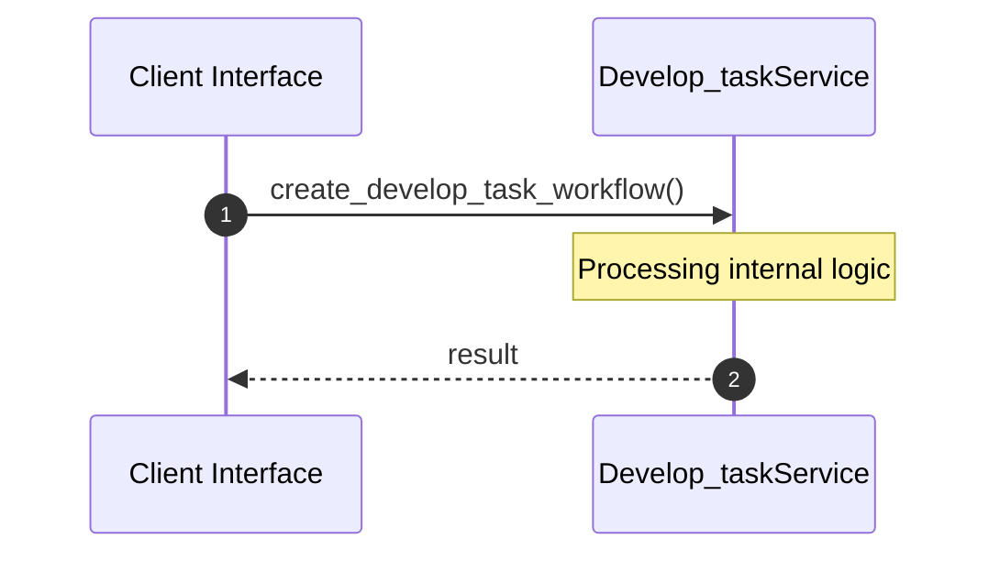

# File: develop_task.rs

**Source Path:** `crates/factory-application/src/workflows/develop_task.rs`

## Overview

### Purpose
Provides implementation for develop_task.rs.

### Responsibilities
* Handles logic related to develop_task.

### Dependencies
* factory_infrastructure::{McpClient, McpHttpClient}, serde::{Deserialize, Serialize}, std::sync::Arc, crate::agents::ZeroClawAgent, hatchet_sdk::Hatchet, hatchet_sdk::runnables::Task

## Public API & Architecture

### Exported Classes / Structs / Interfaces

#### TaskInput

**Overview:** Represents TaskInput.

**Public Methods:**

None.

#### TaskOutput

**Overview:** Represents TaskOutput.

**Public Methods:**

None.

### Exported Functions

#### `create_develop_task_workflow(hatchet: &Hatchet (Any), mcp_url: String (Any)) -> Task<TaskInput, TaskOutput>`
Executes create_develop_task_workflow.

## Internal Architecture & Execution Flow

### Sequence Explanation

## Cross References
* **Parent module:** `crates/factory-application/src/workflows`
* **Dependencies:** factory_infrastructure::{McpClient, McpHttpClient}, serde::{Deserialize, Serialize}, std::sync::Arc, crate::agents::ZeroClawAgent, hatchet_sdk::Hatchet, hatchet_sdk::runnables::Task
