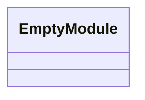
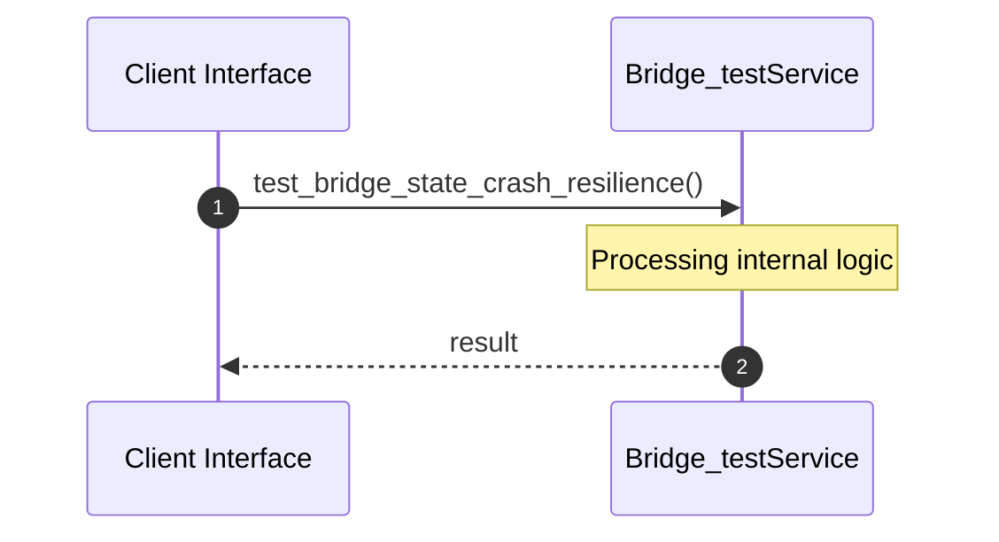

# File: bridge_test.rs

**Source Path:** `crates/factory-application/tests/bridge_test.rs`

## Overview

### Purpose
Provides implementation for bridge_test.rs.

### Responsibilities
* Handles logic related to bridge_test.

### Dependencies
* factory_application::bridge::{BridgeState, StepCheckpoint}

## Public API & Architecture

### Exported Classes / Structs / Interfaces

### Exported Functions

None.

## Internal Architecture & Execution Flow

### Sequence Explanation

## Cross References
* **Parent module:** `crates/factory-application/tests`
* **Dependencies:** factory_application::bridge::{BridgeState, StepCheckpoint}
