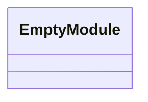
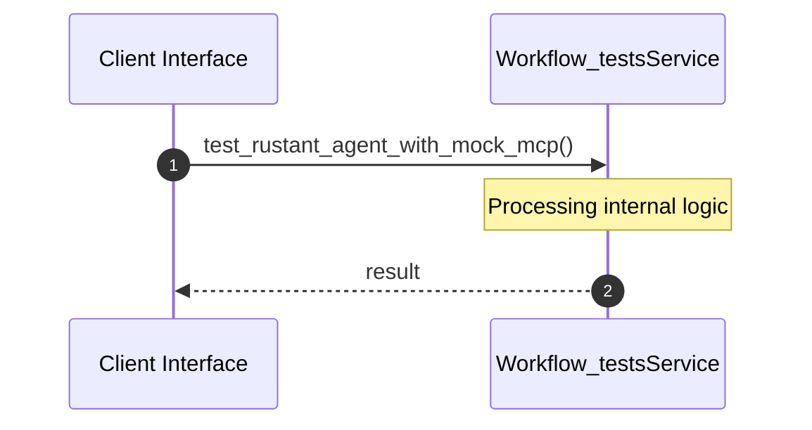

# File: workflow_tests.rs

**Source Path:** `crates/factory-application/tests/workflow_tests.rs`

## Overview

### Purpose
Provides implementation for workflow_tests.rs.

### Responsibilities
* Handles logic related to workflow_tests.

### Dependencies
* factory_infrastructure::{MockMcpClient, MockR2rClient}, std::sync::Arc, factory_application::agents::RustantAgent, serde_json::json

## Public API & Architecture

### Exported Classes / Structs / Interfaces

### Exported Functions

None.

## Internal Architecture & Execution Flow

### Sequence Explanation

## Cross References
* **Parent module:** `crates/factory-application/tests`
* **Dependencies:** factory_infrastructure::{MockMcpClient, MockR2rClient}, std::sync::Arc, factory_application::agents::RustantAgent, serde_json::json
