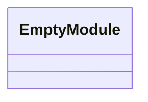
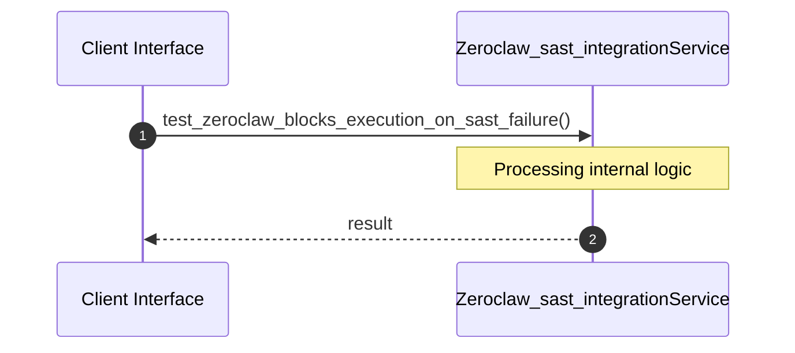

# File: zeroclaw_sast_integration.rs

**Source Path:** `crates/factory-application/tests/zeroclaw_sast_integration.rs`

## Overview

### Purpose
Provides implementation for zeroclaw_sast_integration.rs.

### Responsibilities
* Handles logic related to zeroclaw_sast_integration.

### Dependencies
* factory_application::agents::ZeroClawAgent, serde_json::json, std::sync::Arc, factory_infrastructure::MockMcpClient

## Public API & Architecture

### Exported Classes / Structs / Interfaces

### Exported Functions

None.

## Internal Architecture & Execution Flow

### Sequence Explanation

## Cross References
* **Parent module:** `crates/factory-application/tests`
* **Dependencies:** factory_application::agents::ZeroClawAgent, serde_json::json, std::sync::Arc, factory_infrastructure::MockMcpClient
