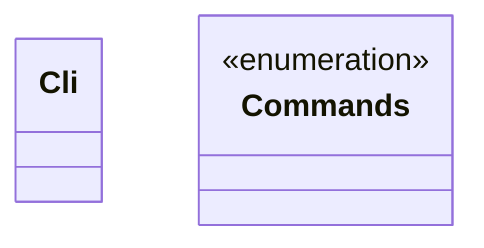
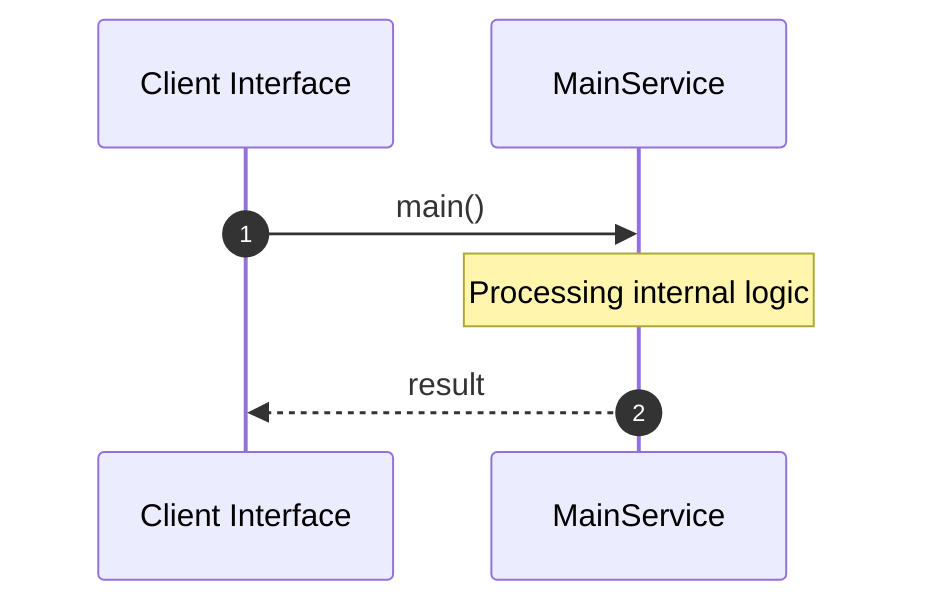

# File: main.rs

**Source Path:** `crates/factory-cli/src/main.rs`

## Overview

### Purpose
Provides implementation for main.rs.

### Responsibilities
* Handles logic related to main.

### Dependencies
* factory_infrastructure::r2r::R2rClient, clap::{Parser, Subcommand}

## Public API & Architecture

### Exported Classes / Structs / Interfaces

#### Cli

**Overview:** Represents Cli.

**Public Methods:**

None.

#### Commands

**Overview:** Represents Commands.

**Public Methods:**

None.

### Exported Functions

None.

## Internal Architecture & Execution Flow

### Sequence Explanation

## Cross References
* **Parent module:** `crates/factory-cli/src`
* **Dependencies:** factory_infrastructure::r2r::R2rClient, clap::{Parser, Subcommand}
