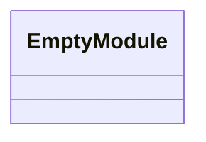
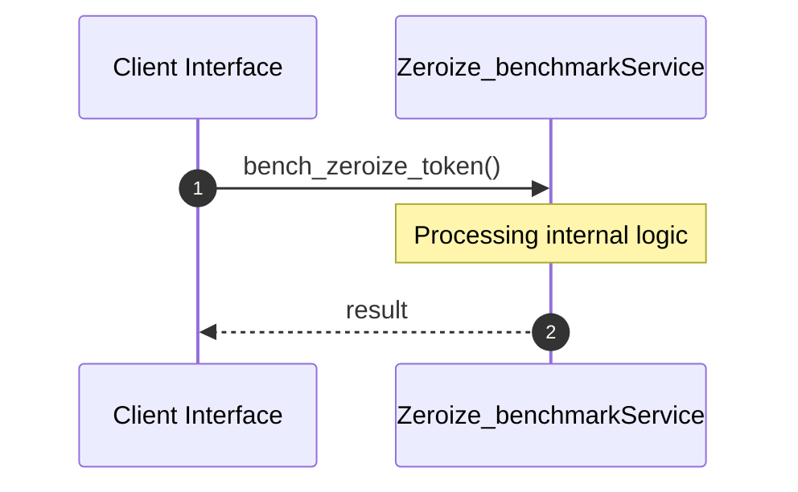

# File: zeroize_benchmark.rs

**Source Path:** `crates/factory-core/benches/zeroize_benchmark.rs`

## Overview

### Purpose
Provides implementation for zeroize_benchmark.rs.

### Responsibilities
* Handles logic related to zeroize_benchmark.

### Dependencies
* factory_core::security::JitToken, zeroize::Zeroize, criterion::{black_box, criterion_group, criterion_main, Criterion}

## Public API & Architecture

### Exported Classes / Structs / Interfaces

### Exported Functions

None.

## Internal Architecture & Execution Flow

### Sequence Explanation

## Cross References
* **Parent module:** `crates/factory-core/benches`
* **Dependencies:** factory_core::security::JitToken, zeroize::Zeroize, criterion::{black_box, criterion_group, criterion_main, Criterion}
