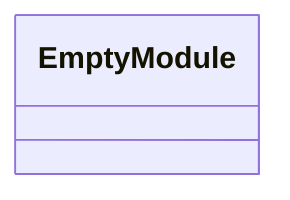
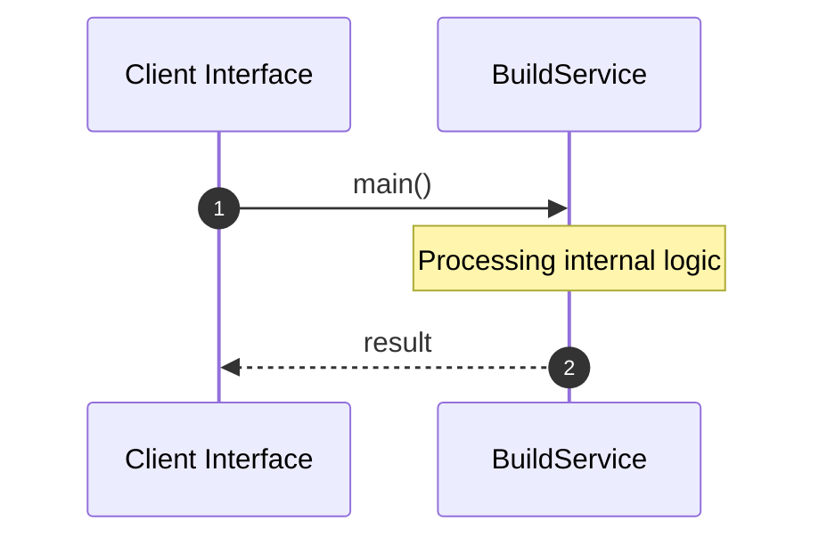

# File: build.rs

**Source Path:** `crates/factory-core/build.rs`

## Overview

### Purpose
Provides implementation for build.rs.

### Responsibilities
* Handles logic related to build.

### Dependencies
* None

## Public API & Architecture

### Exported Classes / Structs / Interfaces

### Exported Functions

None.

## Internal Architecture & Execution Flow

### Sequence Explanation

## Cross References
* **Parent module:** `crates/factory-core`
* **Dependencies:** None
