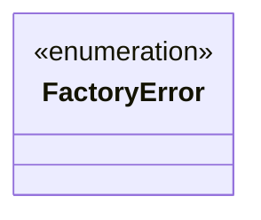
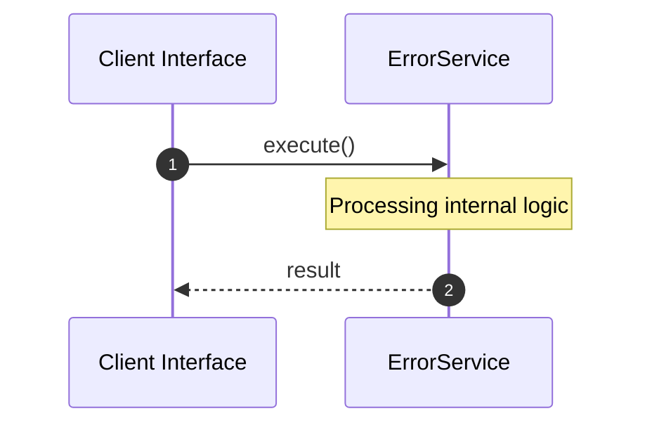

# File: error.rs

**Source Path:** `crates/factory-core/src/error.rs`

## Overview

### Purpose
Provides implementation for error.rs.

### Responsibilities
* Handles logic related to error.

### Dependencies
* thiserror::Error

## Public API & Architecture

### Exported Classes / Structs / Interfaces

#### FactoryError

**Overview:** Represents FactoryError.

**Public Methods:**

None.

### Exported Functions

None.

## Internal Architecture & Execution Flow

### Sequence Explanation

## Cross References
* **Parent module:** `crates/factory-core/src`
* **Dependencies:** thiserror::Error
