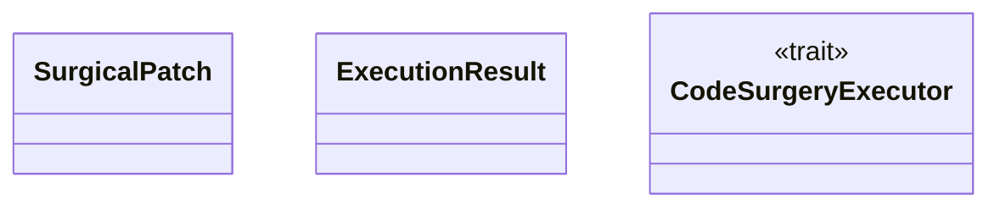
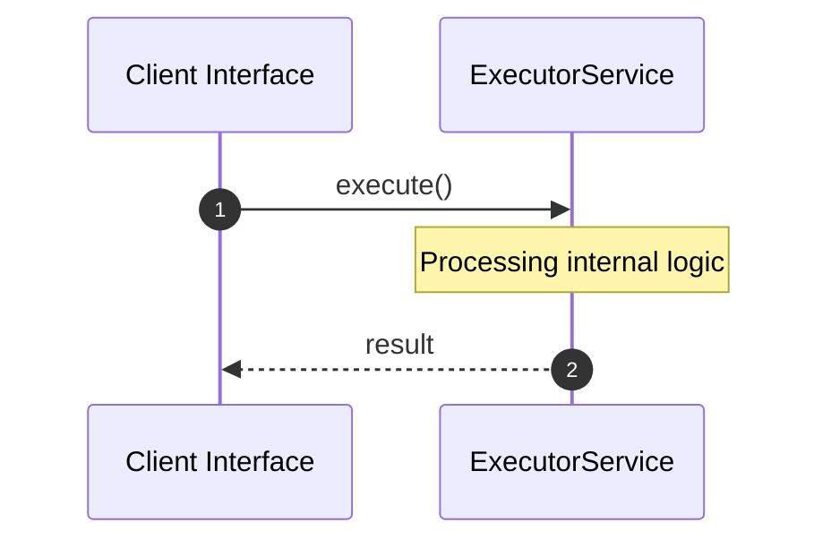

# File: executor.rs

**Source Path:** `crates/factory-core/src/executor.rs`

## Overview

### Purpose
Provides implementation for executor.rs.

### Responsibilities
* Handles logic related to executor.

### Dependencies
* std::path::PathBuf, crate::error::FactoryError, async_trait::async_trait

## Public API & Architecture

### Exported Classes / Structs / Interfaces

#### SurgicalPatch

**Overview:** Represents SurgicalPatch.

**Public Methods:**

None.

#### ExecutionResult

**Overview:** Represents ExecutionResult.

**Public Methods:**

None.

#### CodeSurgeryExecutor

**Overview:** Represents CodeSurgeryExecutor.

**Public Methods:**

None.

### Exported Functions

None.

## Internal Architecture & Execution Flow

### Sequence Explanation

## Cross References
* **Parent module:** `crates/factory-core/src`
* **Dependencies:** std::path::PathBuf, crate::error::FactoryError, async_trait::async_trait
