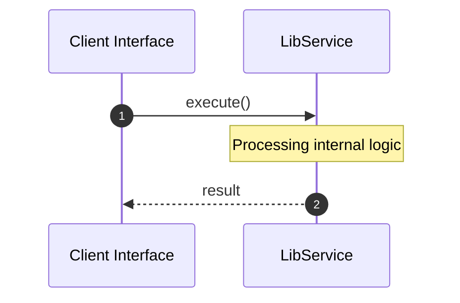

# File: lib.rs

**Source Path:** `crates/factory-core/src/lib.rs`

## Overview

### Purpose
Provides implementation for lib.rs.

### Responsibilities
* Handles logic related to lib.

### Dependencies
* uuid::Uuid, std::collections::HashMap, chrono::{DateTime, Utc}, serde::{Deserialize, Serialize}

## Public API & Architecture

### Exported Classes / Structs / Interfaces

#### Metadata

**Overview:** Represents Metadata.

**Public Methods:**

None.

#### Inputs

**Overview:** Represents Inputs.

**Public Methods:**

None.

#### Outputs

**Overview:** Represents Outputs.

**Public Methods:**

None.

#### Targets

**Overview:** Represents Targets.

**Public Methods:**

None.

#### Mission

**Overview:** Represents Mission.

**Public Methods:**

None.

#### MissionStatus

**Overview:** Represents MissionStatus.

**Public Methods:**

None.

#### Task

**Overview:** Represents Task.

**Public Methods:**

None.

#### TaskStatus

**Overview:** Represents TaskStatus.

**Public Methods:**

None.

#### SHAPValues

**Overview:** Represents SHAPValues.

**Public Methods:**

None.

#### FeatureImportances

**Overview:** Represents FeatureImportances.

**Public Methods:**

None.

#### SpecArtifact

**Overview:** Represents SpecArtifact.

**Public Methods:**

None.

#### OsrMetric

**Overview:** Represents OsrMetric.

**Public Methods:**

None.

#### FinOpsTag

**Overview:** Represents FinOpsTag.

**Public Methods:**

None.

#### ComplianceReport

**Overview:** Represents ComplianceReport.

**Public Methods:**

None.

#### UserFeedbackPayload

**Overview:** Represents UserFeedbackPayload.

**Public Methods:**

None.

### Exported Functions

None.

## Internal Architecture & Execution Flow

```mermaid
classDiagram
    direction BT
    class Metadata {
    }
    class Inputs {
    }
    class Outputs {
    }
    class Targets {
    }
    class Mission {
    }
    class MissionStatus {
        <<enumeration>>
    }
    class Task {
    }
    class TaskStatus {
        <<enumeration>>
    }
    class SHAPValues {
    }
    class FeatureImportances {
    }
    class SpecArtifact {
    }
    class OsrMetric {
    }
    class FinOpsTag {
    }
    class ComplianceReport {
    }
    class UserFeedbackPayload {
    }

```

### Sequence Explanation

## Cross References
* **Parent module:** `crates/factory-core/src`
* **Dependencies:** uuid::Uuid, std::collections::HashMap, chrono::{DateTime, Utc}, serde::{Deserialize, Serialize}
