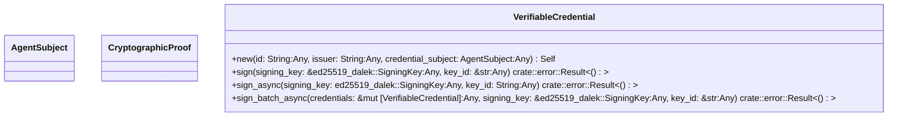
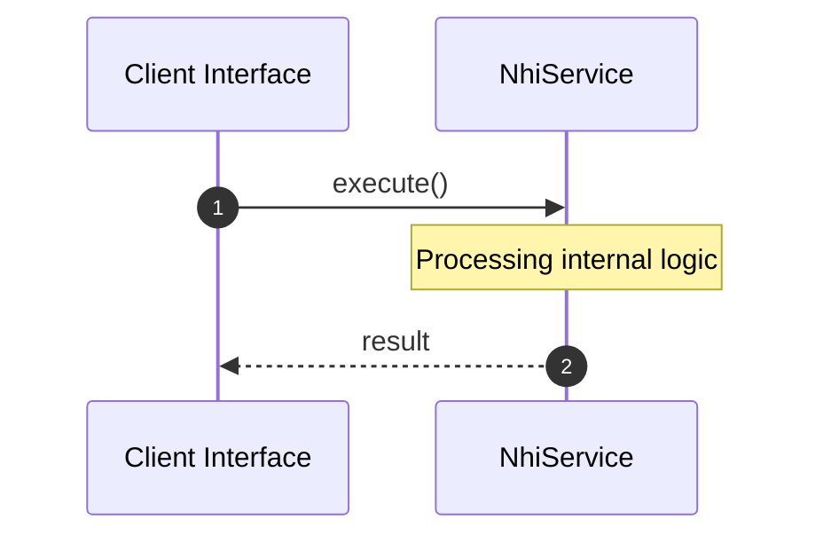

# File: nhi.rs

**Source Path:** `crates/factory-core/src/security/nhi.rs`

## Overview

### Purpose
Provides implementation for nhi.rs.

### Responsibilities
* Handles logic related to nhi.

### Dependencies
* ed25519_dalek::Signer, base64::{engine::general_purpose::URL_SAFE_NO_PAD, Engine as _}, ed25519_dalek::SigningKey, super::*, serde::{Deserialize, Serialize}, chrono::{DateTime, Utc}, rand::rngs::OsRng

## Public API & Architecture

### Exported Classes / Structs / Interfaces

#### AgentSubject

**Overview:** Represents AgentSubject.

**Public Methods:**

None.

#### CryptographicProof

**Overview:** Represents CryptographicProof.

**Public Methods:**

None.

#### VerifiableCredential

**Overview:** Represents VerifiableCredential.

**Public Methods:**

##### `new(id: String (Any), issuer: String (Any), credential_subject: AgentSubject (Any)) -> Self`
Executes new.

##### `sign(signing_key: &ed25519_dalek::SigningKey (Any), key_id: &str (Any)) -> crate::error::Result<()>`
/// Generates a JWS for the credential and attaches it to the `proof` field.

##### `sign_async(signing_key: ed25519_dalek::SigningKey (Any), key_id: String (Any)) -> crate::error::Result<()>`
/// Asynchronously signs credentials without blocking the Tokio task executor.

##### `sign_batch_async(credentials: &mut [VerifiableCredential] (Any), signing_key: &ed25519_dalek::SigningKey (Any), key_id: &str (Any)) -> crate::error::Result<()>`
/// Asynchronously batch-signs multiple credentials concurrently.

### Exported Functions

None.

## Internal Architecture & Execution Flow

### Sequence Explanation

## Cross References
* **Parent module:** `crates/factory-core/src/security`
* **Dependencies:** ed25519_dalek::Signer, base64::{engine::general_purpose::URL_SAFE_NO_PAD, Engine as _}, ed25519_dalek::SigningKey, super::*, serde::{Deserialize, Serialize}, chrono::{DateTime, Utc}, rand::rngs::OsRng
