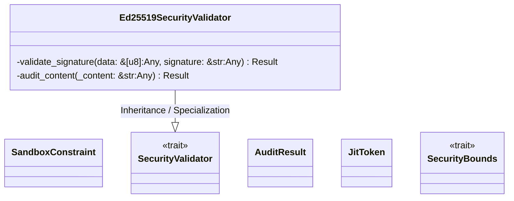
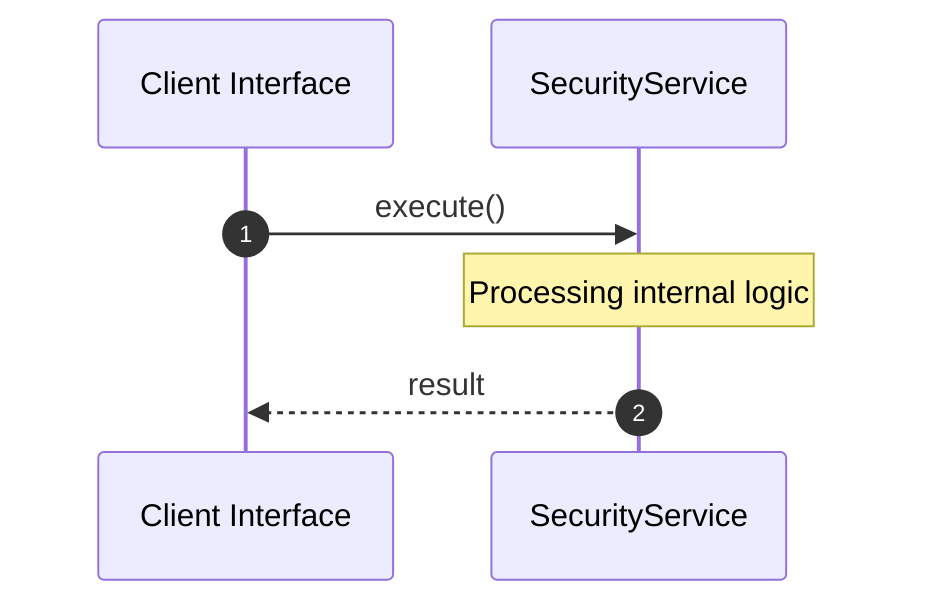

# File: security.rs

**Source Path:** `crates/factory-core/src/security.rs`

## Overview

### Purpose
Provides implementation for security.rs.

### Responsibilities
* Handles logic related to security.

### Dependencies
* async_trait::async_trait, base64::{engine::general_purpose::URL_SAFE_NO_PAD, Engine as _}, ed25519_dalek::{Signature, Verifier}, crate::error::Result, zeroize::Zeroize

## Public API & Architecture

### Exported Classes / Structs / Interfaces

#### SandboxConstraint

**Overview:** Represents SandboxConstraint.

**Public Methods:**

None.

#### SecurityValidator

**Overview:** Represents SecurityValidator.

**Public Methods:**

None.

#### AuditResult

**Overview:** Represents AuditResult.

**Public Methods:**

None.

#### Ed25519SecurityValidator

**Overview:** Represents Ed25519SecurityValidator.

**Public Methods:**

None.

#### JitToken

**Overview:** Represents JitToken.

**Public Methods:**

None.

#### SecurityBounds

**Overview:** Represents SecurityBounds.

**Public Methods:**

None.

### Exported Functions

None.

## Internal Architecture & Execution Flow

### Sequence Explanation

## Cross References
* **Parent module:** `crates/factory-core/src`
* **Dependencies:** async_trait::async_trait, base64::{engine::general_purpose::URL_SAFE_NO_PAD, Engine as _}, ed25519_dalek::{Signature, Verifier}, crate::error::Result, zeroize::Zeroize
