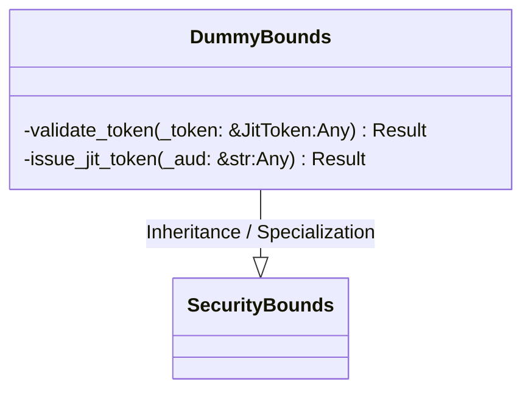
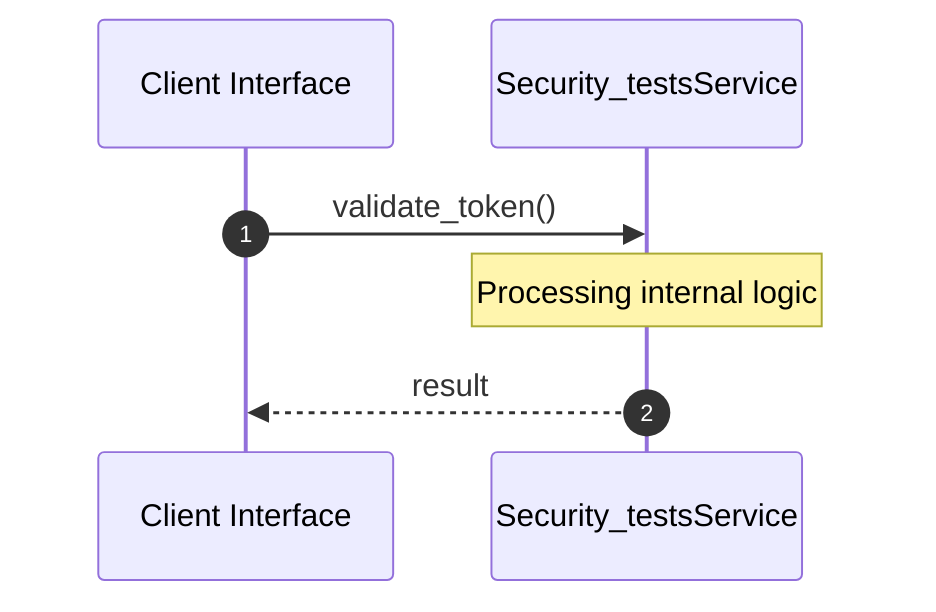

# File: security_tests.rs

**Source Path:** `crates/factory-core/tests/security_tests.rs`

## Overview

### Purpose
Provides implementation for security_tests.rs.

### Responsibilities
* Handles logic related to security_tests.

### Dependencies
* factory_core::error::Result, factory_core::security::JitToken, factory_core::security::SecurityBounds

## Public API & Architecture

### Exported Classes / Structs / Interfaces

#### DummyBounds

**Overview:** Represents DummyBounds.

**Public Methods:**

None.

### Exported Functions

None.

## Internal Architecture & Execution Flow

### Sequence Explanation

## Cross References
* **Parent module:** `crates/factory-core/tests`
* **Dependencies:** factory_core::error::Result, factory_core::security::JitToken, factory_core::security::SecurityBounds
