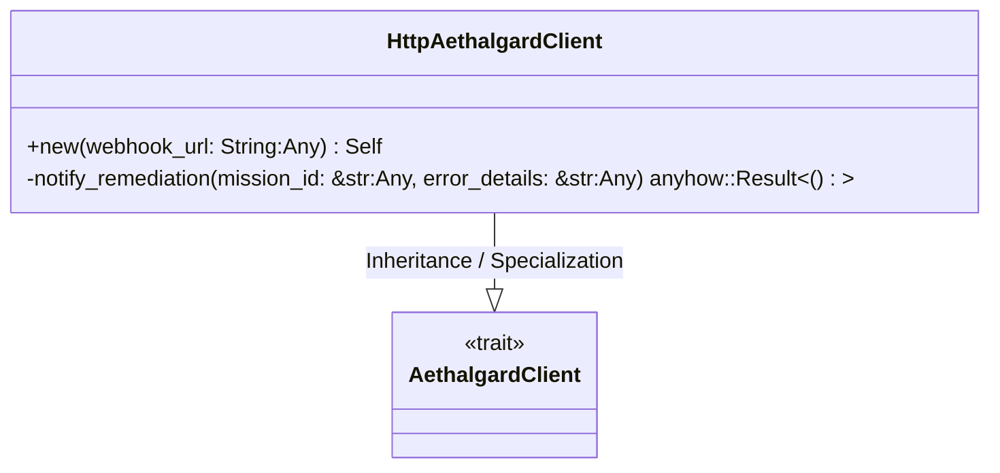
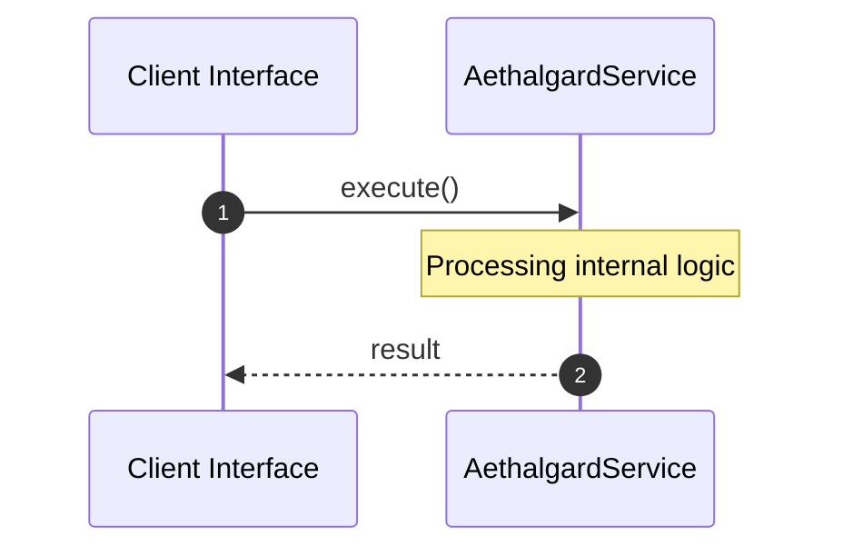

# File: aethalgard.rs

**Source Path:** `crates/factory-infrastructure/src/aethalgard.rs`

## Overview

### Purpose
Provides implementation for aethalgard.rs.

### Responsibilities
* Handles logic related to aethalgard.

### Dependencies
* async_trait::async_trait, serde_json::json

## Public API & Architecture

### Exported Classes / Structs / Interfaces

#### AethalgardClient

**Overview:** Represents AethalgardClient.

**Public Methods:**

None.

#### HttpAethalgardClient

**Overview:** Represents HttpAethalgardClient.

**Public Methods:**

##### `new(webhook_url: String (Any)) -> Self`
Executes new.

### Exported Functions

None.

## Internal Architecture & Execution Flow

### Sequence Explanation

## Cross References
* **Parent module:** `crates/factory-infrastructure/src`
* **Dependencies:** async_trait::async_trait, serde_json::json
