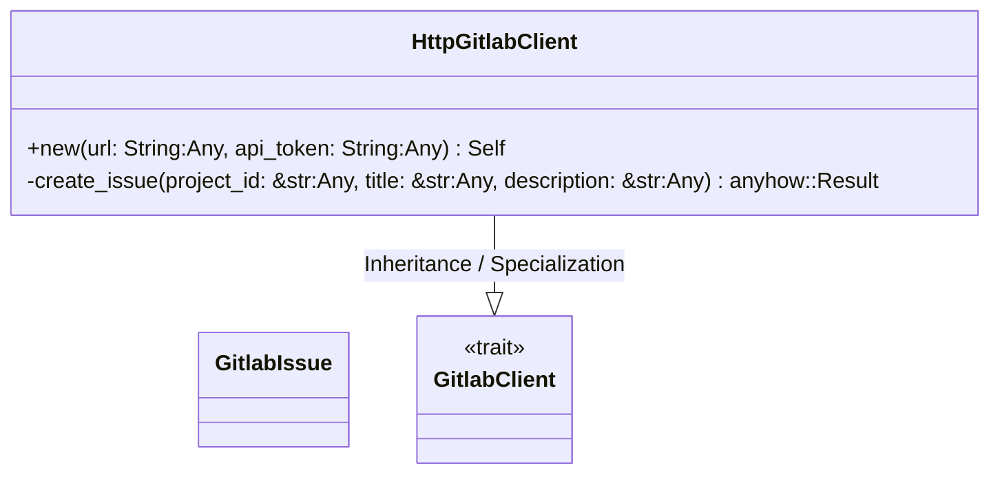
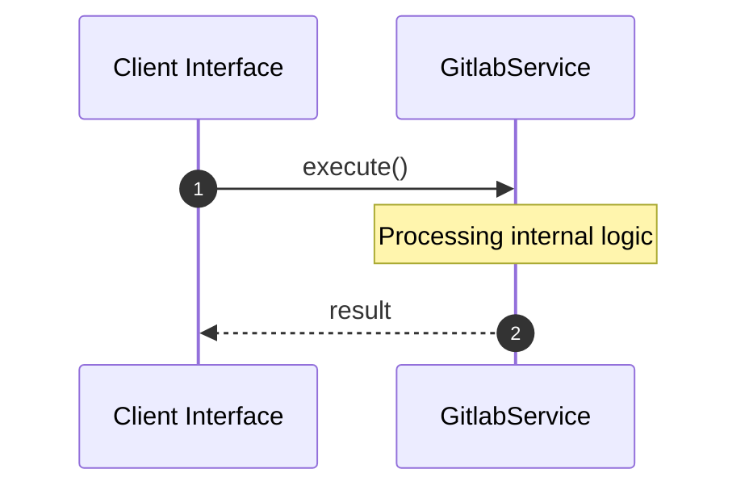

# File: gitlab.rs

**Source Path:** `crates/factory-infrastructure/src/gitlab.rs`

## Overview

### Purpose
Provides implementation for gitlab.rs.

### Responsibilities
* Handles logic related to gitlab.

### Dependencies
* wiremock::matchers::{body_json, header, method, path}, serde_json::json, async_trait::async_trait, super::*, wiremock::{Mock, MockServer, ResponseTemplate}, serde::{Deserialize, Serialize}

## Public API & Architecture

### Exported Classes / Structs / Interfaces

#### GitlabIssue

**Overview:** Represents GitlabIssue.

**Public Methods:**

None.

#### GitlabClient

**Overview:** Represents GitlabClient.

**Public Methods:**

None.

#### HttpGitlabClient

**Overview:** Represents HttpGitlabClient.

**Public Methods:**

##### `new(url: String (Any), api_token: String (Any)) -> Self`
Executes new.

### Exported Functions

None.

## Internal Architecture & Execution Flow

### Sequence Explanation

## Cross References
* **Parent module:** `crates/factory-infrastructure/src`
* **Dependencies:** wiremock::matchers::{body_json, header, method, path}, serde_json::json, async_trait::async_trait, super::*, wiremock::{Mock, MockServer, ResponseTemplate}, serde::{Deserialize, Serialize}
