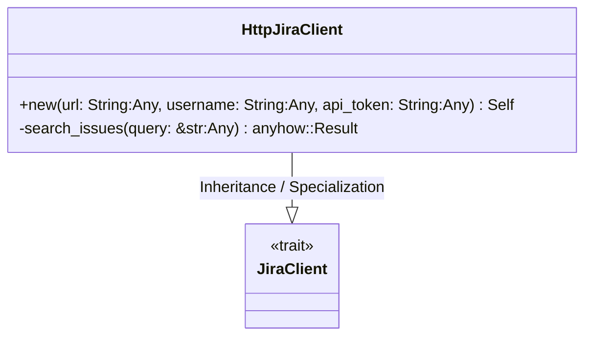
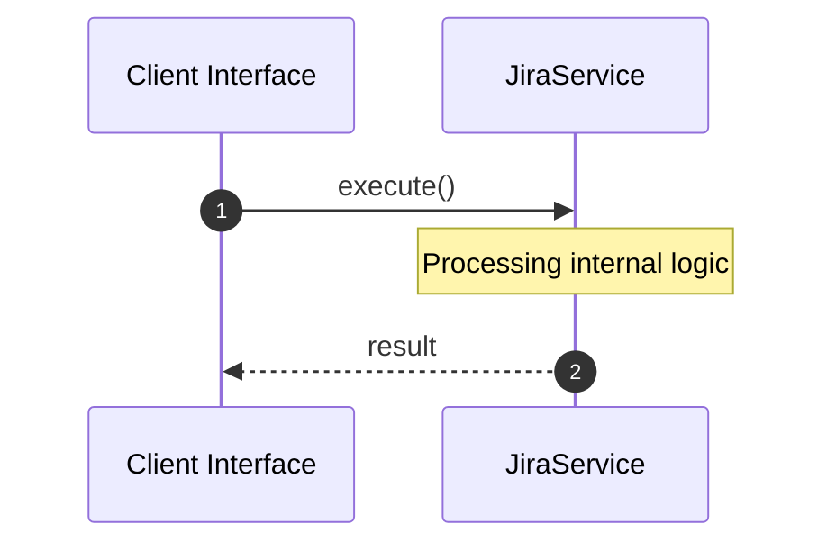

# File: jira.rs

**Source Path:** `crates/factory-infrastructure/src/jira.rs`

## Overview

### Purpose
Provides implementation for jira.rs.

### Responsibilities
* Handles logic related to jira.

### Dependencies
* serde_json::json, super::*, wiremock::matchers::{method, path, query_param}, wiremock::{Mock, MockServer, ResponseTemplate}, async_trait::async_trait

## Public API & Architecture

### Exported Classes / Structs / Interfaces

#### JiraClient

**Overview:** Represents JiraClient.

**Public Methods:**

None.

#### HttpJiraClient

**Overview:** Represents HttpJiraClient.

**Public Methods:**

##### `new(url: String (Any), username: String (Any), api_token: String (Any)) -> Self`
Executes new.

### Exported Functions

None.

## Internal Architecture & Execution Flow

### Sequence Explanation

## Cross References
* **Parent module:** `crates/factory-infrastructure/src`
* **Dependencies:** serde_json::json, super::*, wiremock::matchers::{method, path, query_param}, wiremock::{Mock, MockServer, ResponseTemplate}, async_trait::async_trait
