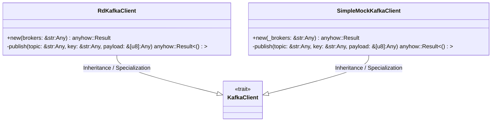
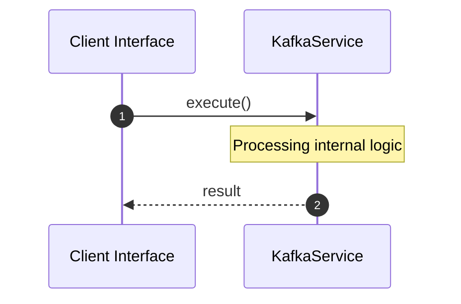

# File: kafka.rs

**Source Path:** `crates/factory-infrastructure/src/kafka.rs`

## Overview

### Purpose
Provides implementation for kafka.rs.

### Responsibilities
* Handles logic related to kafka.

### Dependencies
* rdkafka::producer::{FutureProducer, FutureRecord}, rdkafka::config::ClientConfig, async_trait::async_trait, chrono::Utc, std::time::Duration

## Public API & Architecture

### Exported Classes / Structs / Interfaces

#### KafkaClient

**Overview:** Represents KafkaClient.

**Public Methods:**

None.

#### RdKafkaClient

**Overview:** Represents RdKafkaClient.

**Public Methods:**

##### `new(brokers: &str (Any)) -> anyhow::Result<Self>`
Executes new.

#### SimpleMockKafkaClient

**Overview:** Represents SimpleMockKafkaClient.

**Public Methods:**

##### `new(_brokers: &str (Any)) -> anyhow::Result<Self>`
Executes new.

### Exported Functions

None.

## Internal Architecture & Execution Flow

### Sequence Explanation

## Cross References
* **Parent module:** `crates/factory-infrastructure/src`
* **Dependencies:** rdkafka::producer::{FutureProducer, FutureRecord}, rdkafka::config::ClientConfig, async_trait::async_trait, chrono::Utc, std::time::Duration
