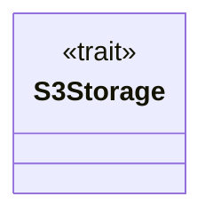
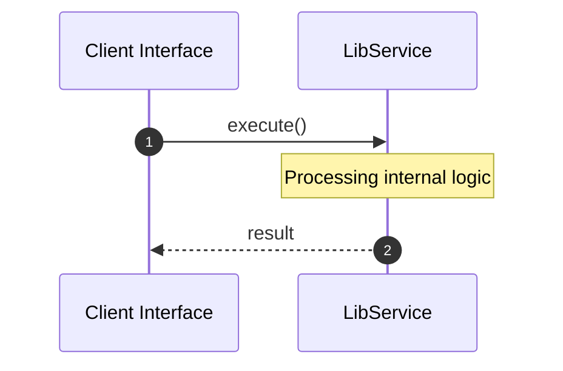

# File: lib.rs

**Source Path:** `crates/factory-infrastructure/src/lib.rs`

## Overview

### Purpose
Provides implementation for lib.rs.

### Responsibilities
* Handles logic related to lib.

### Dependencies
* pub sentry::MockSentryClient, pub aethalgard::MockAethalgardClient, pub kafka::{KafkaClient, RdKafkaClient, SimpleMockKafkaClient}, pub ziti::MockZitiIdentity, pub mcp_client::MockMcpClient, pub r2r::{HttpR2rClient, R2rClient}, pub jira::MockJiraClient, pub jira::{HttpJiraClient, JiraClient}, pub gitlab::MockGitlabClient, pub kafka::{KafkaClient, RdKafkaClient}, pub sentry::{CrashEvent, HttpSentryClient, SentryClient}, pub s3::AwsS3Storage, pub aethalgard::{AethalgardClient, HttpAethalgardClient}, pub ziti::{OpenZitiIdentity, ZitiIdentity}, pub gitlab::{GitlabClient, GitlabIssue, HttpGitlabClient}, pub mcp_client::{McpClient, McpHttpClient, McpSseClient}, pub r2r::MockR2rClient

## Public API & Architecture

### Exported Classes / Structs / Interfaces

#### S3Storage

**Overview:** Represents S3Storage.

**Public Methods:**

None.

### Exported Functions

None.

## Internal Architecture & Execution Flow

### Sequence Explanation

## Cross References
* **Parent module:** `crates/factory-infrastructure/src`
* **Dependencies:** pub sentry::MockSentryClient, pub aethalgard::MockAethalgardClient, pub kafka::{KafkaClient, RdKafkaClient, SimpleMockKafkaClient}, pub ziti::MockZitiIdentity, pub mcp_client::MockMcpClient, pub r2r::{HttpR2rClient, R2rClient}, pub jira::MockJiraClient, pub jira::{HttpJiraClient, JiraClient}, pub gitlab::MockGitlabClient, pub kafka::{KafkaClient, RdKafkaClient}, pub sentry::{CrashEvent, HttpSentryClient, SentryClient}, pub s3::AwsS3Storage, pub aethalgard::{AethalgardClient, HttpAethalgardClient}, pub ziti::{OpenZitiIdentity, ZitiIdentity}, pub gitlab::{GitlabClient, GitlabIssue, HttpGitlabClient}, pub mcp_client::{McpClient, McpHttpClient, McpSseClient}, pub r2r::MockR2rClient
