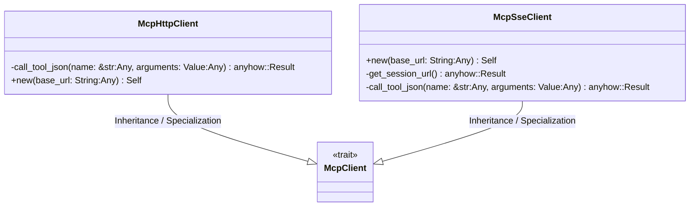
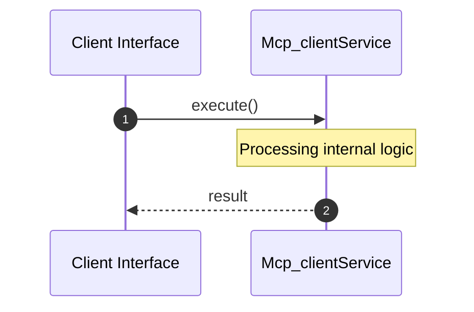

# File: mcp_client.rs

**Source Path:** `crates/factory-infrastructure/src/mcp_client.rs`

## Overview

### Purpose
Provides implementation for mcp_client.rs.

### Responsibilities
* Handles logic related to mcp_client.

### Dependencies
* tokio::sync::OnceCell, anyhow::anyhow, reqwest::Client, wiremock::matchers::{method, path}, serde_json::{json, Value}, futures_util::StreamExt, wiremock::{Mock, MockServer, ResponseTemplate}, super::*

## Public API & Architecture

### Exported Classes / Structs / Interfaces

#### McpClient

**Overview:** Represents McpClient.

**Public Methods:**

None.

#### McpHttpClient

**Overview:** Represents McpHttpClient.

**Public Methods:**

##### `new(base_url: String (Any)) -> Self`
Executes new.

#### McpSseClient

**Overview:** /// A client that uses SSE handshake to find the session endpoint

**Public Methods:**

##### `new(base_url: String (Any)) -> Self`
Executes new.

### Exported Functions

None.

## Internal Architecture & Execution Flow

### Sequence Explanation

## Cross References
* **Parent module:** `crates/factory-infrastructure/src`
* **Dependencies:** tokio::sync::OnceCell, anyhow::anyhow, reqwest::Client, wiremock::matchers::{method, path}, serde_json::{json, Value}, futures_util::StreamExt, wiremock::{Mock, MockServer, ResponseTemplate}, super::*
