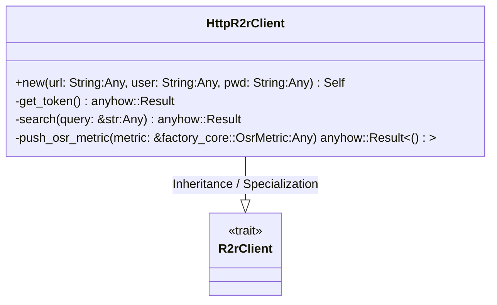
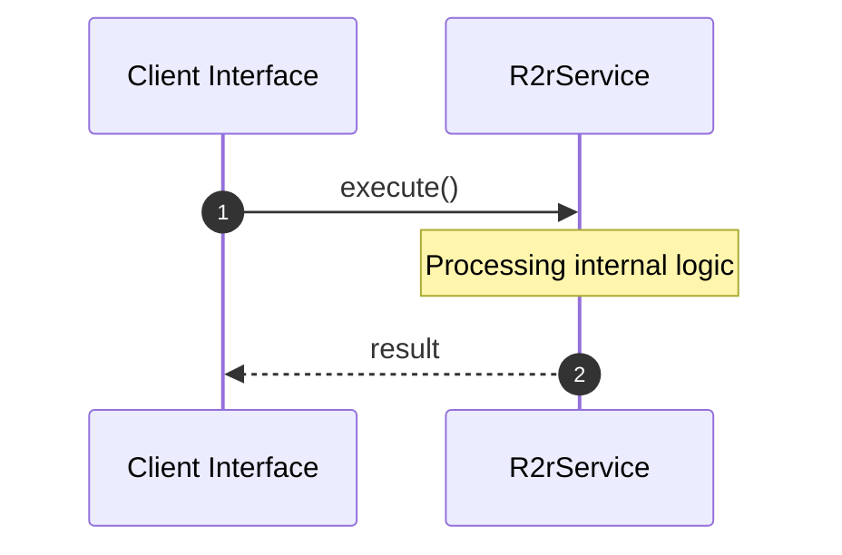

# File: r2r.rs

**Source Path:** `crates/factory-infrastructure/src/r2r.rs`

## Overview

### Purpose
Provides implementation for r2r.rs.

### Responsibilities
* Handles logic related to r2r.

### Dependencies
* wiremock::{Mock, MockServer, ResponseTemplate}, async_trait::async_trait, super::*, wiremock::matchers::{method, path}, serde_json::json

## Public API & Architecture

### Exported Classes / Structs / Interfaces

#### R2rClient

**Overview:** Represents R2rClient.

**Public Methods:**

None.

#### HttpR2rClient

**Overview:** Represents HttpR2rClient.

**Public Methods:**

##### `new(url: String (Any), user: String (Any), pwd: String (Any)) -> Self`
Executes new.

### Exported Functions

None.

## Internal Architecture & Execution Flow

### Sequence Explanation

## Cross References
* **Parent module:** `crates/factory-infrastructure/src`
* **Dependencies:** wiremock::{Mock, MockServer, ResponseTemplate}, async_trait::async_trait, super::*, wiremock::matchers::{method, path}, serde_json::json
