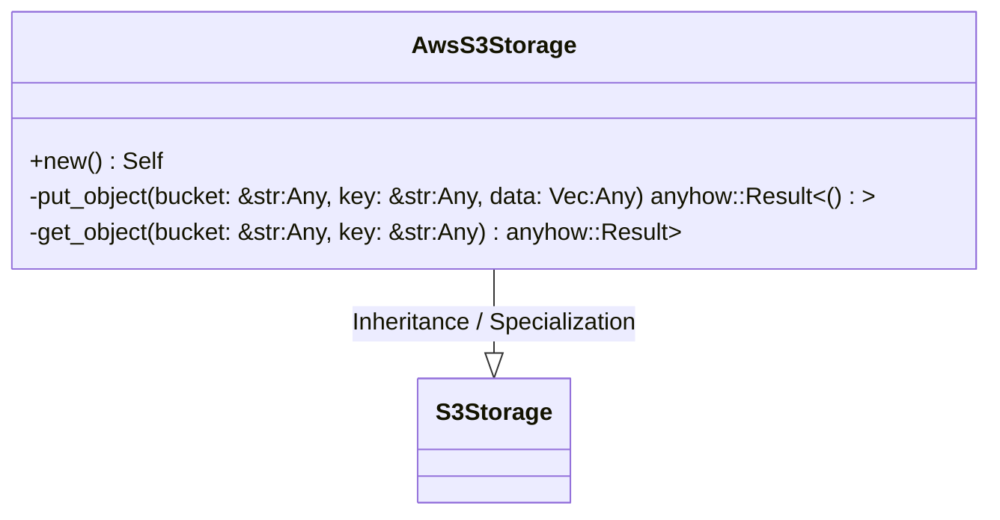
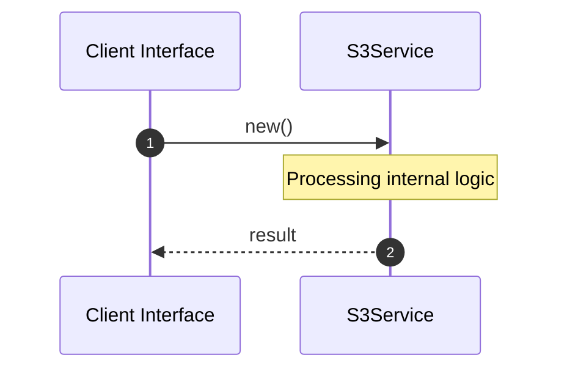

# File: s3.rs

**Source Path:** `crates/factory-infrastructure/src/s3.rs`

## Overview

### Purpose
Provides implementation for s3.rs.

### Responsibilities
* Handles logic related to s3.

### Dependencies
* async_trait::async_trait, aws_sdk_s3::Client, aws_sdk_s3::primitives::ByteStream, crate::S3Storage

## Public API & Architecture

### Exported Classes / Structs / Interfaces

#### AwsS3Storage

**Overview:** Represents AwsS3Storage.

**Public Methods:**

##### `new() -> Self`
Executes new.

### Exported Functions

None.

## Internal Architecture & Execution Flow

### Sequence Explanation

## Cross References
* **Parent module:** `crates/factory-infrastructure/src`
* **Dependencies:** async_trait::async_trait, aws_sdk_s3::Client, aws_sdk_s3::primitives::ByteStream, crate::S3Storage
