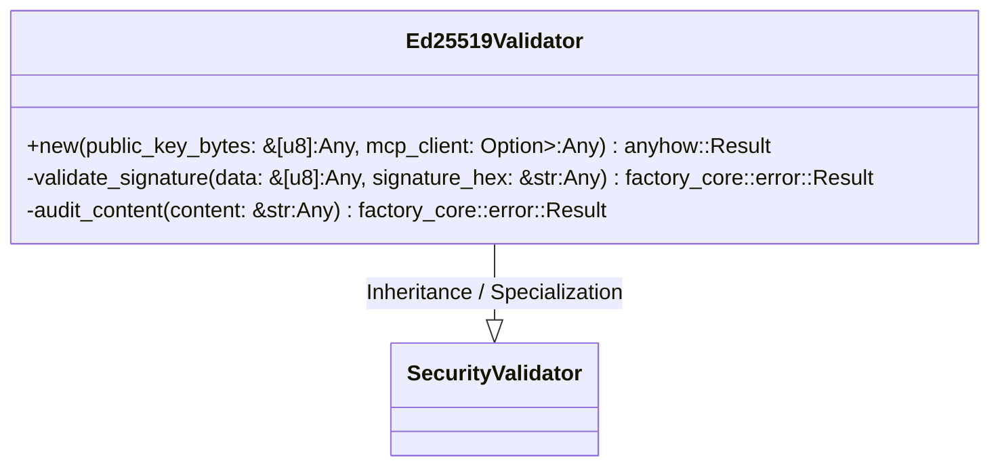
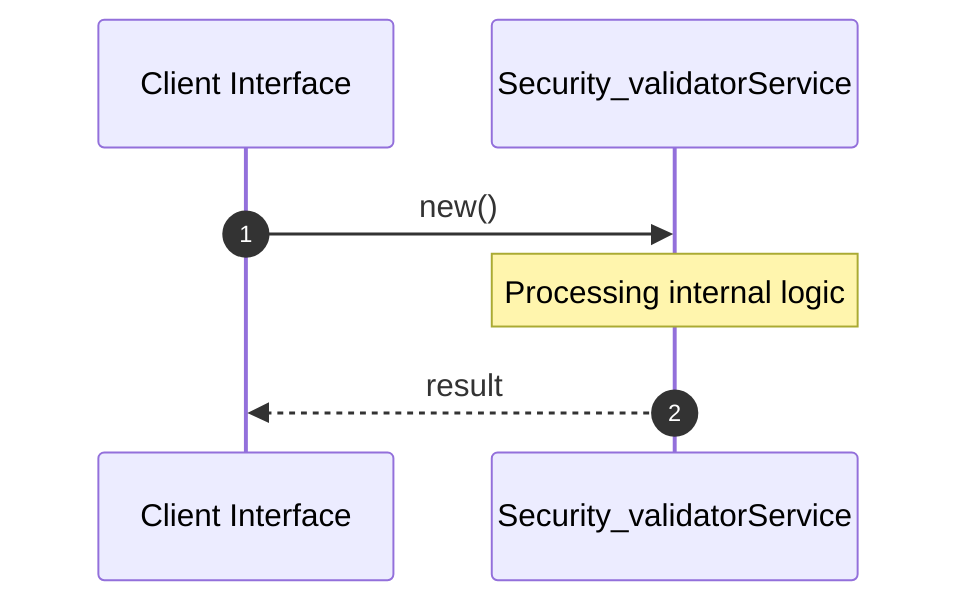

# File: security_validator.rs

**Source Path:** `crates/factory-infrastructure/src/security_validator.rs`

## Overview

### Purpose
Provides implementation for security_validator.rs.

### Responsibilities
* Handles logic related to security_validator.

### Dependencies
* async_trait::async_trait, std::sync::Arc, super::*, ed25519_dalek::{Signature, Verifier, VerifyingKey}, rand::rngs::OsRng, crate::mcp_client::McpClient, ed25519_dalek::{Signer, SigningKey}, factory_core::security::{AuditResult, SecurityValidator}

## Public API & Architecture

### Exported Classes / Structs / Interfaces

#### Ed25519Validator

**Overview:** Represents Ed25519Validator.

**Public Methods:**

##### `new(public_key_bytes: &[u8] (Any), mcp_client: Option<Arc<dyn McpClient>> (Any)) -> anyhow::Result<Self>`
Executes new.

### Exported Functions

None.

## Internal Architecture & Execution Flow

### Sequence Explanation

## Cross References
* **Parent module:** `crates/factory-infrastructure/src`
* **Dependencies:** async_trait::async_trait, std::sync::Arc, super::*, ed25519_dalek::{Signature, Verifier, VerifyingKey}, rand::rngs::OsRng, crate::mcp_client::McpClient, ed25519_dalek::{Signer, SigningKey}, factory_core::security::{AuditResult, SecurityValidator}
