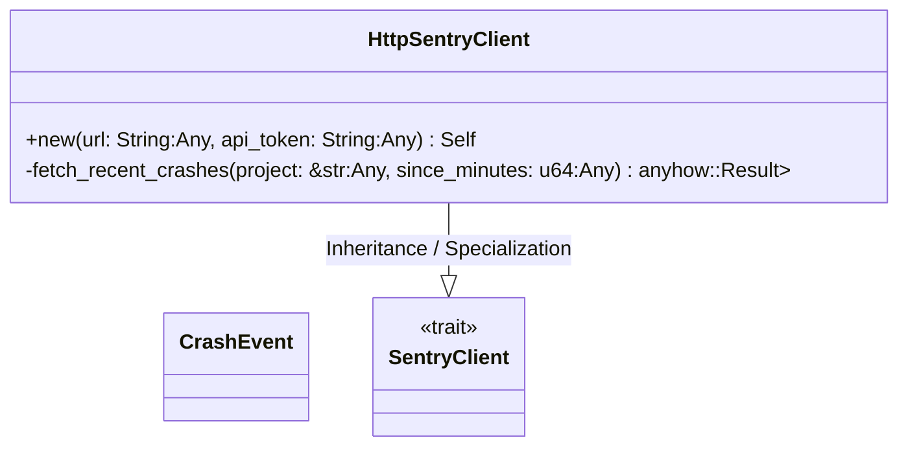
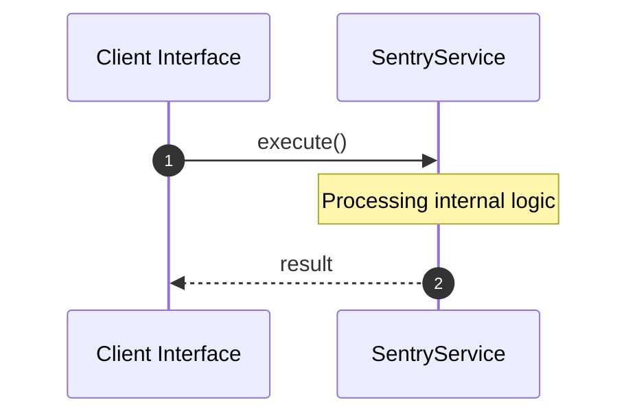

# File: sentry.rs

**Source Path:** `crates/factory-infrastructure/src/sentry.rs`

## Overview

### Purpose
Provides implementation for sentry.rs.

### Responsibilities
* Handles logic related to sentry.

### Dependencies
* wiremock::{Mock, MockServer, ResponseTemplate}, super::*, wiremock::matchers::{header, method, path, query_param}, serde_json::json, async_trait::async_trait, serde::{Deserialize, Serialize}

## Public API & Architecture

### Exported Classes / Structs / Interfaces

#### CrashEvent

**Overview:** Represents CrashEvent.

**Public Methods:**

None.

#### SentryClient

**Overview:** Represents SentryClient.

**Public Methods:**

None.

#### HttpSentryClient

**Overview:** Represents HttpSentryClient.

**Public Methods:**

##### `new(url: String (Any), api_token: String (Any)) -> Self`
Executes new.

### Exported Functions

None.

## Internal Architecture & Execution Flow

### Sequence Explanation

## Cross References
* **Parent module:** `crates/factory-infrastructure/src`
* **Dependencies:** wiremock::{Mock, MockServer, ResponseTemplate}, super::*, wiremock::matchers::{header, method, path, query_param}, serde_json::json, async_trait::async_trait, serde::{Deserialize, Serialize}
