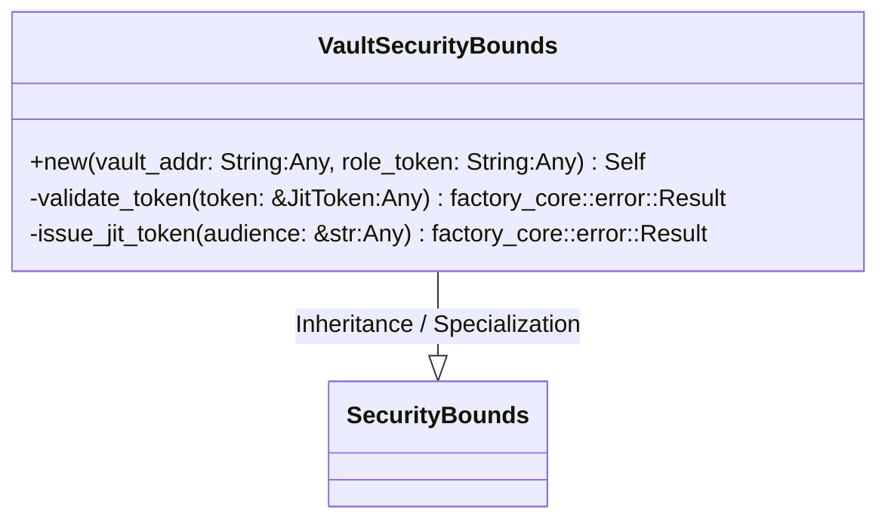
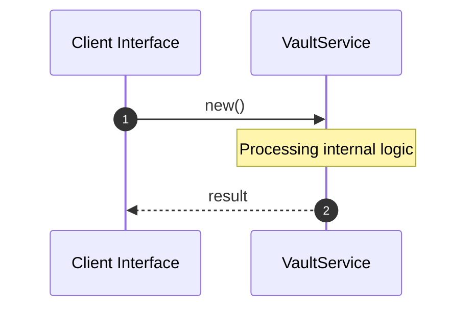

# File: vault.rs

**Source Path:** `crates/factory-infrastructure/src/vault.rs`

## Overview

### Purpose
Provides implementation for vault.rs.

### Responsibilities
* Handles logic related to vault.

### Dependencies
* super::*, wiremock::{Mock, MockServer, ResponseTemplate}, wiremock::matchers::{header, method, path}, factory_core::security::{JitToken, SecurityBounds}, reqwest::Client, async_trait::async_trait, serde_json::json

## Public API & Architecture

### Exported Classes / Structs / Interfaces

#### VaultSecurityBounds

**Overview:** Represents VaultSecurityBounds.

**Public Methods:**

##### `new(vault_addr: String (Any), role_token: String (Any)) -> Self`
Executes new.

### Exported Functions

None.

## Internal Architecture & Execution Flow

### Sequence Explanation

## Cross References
* **Parent module:** `crates/factory-infrastructure/src`
* **Dependencies:** super::*, wiremock::{Mock, MockServer, ResponseTemplate}, wiremock::matchers::{header, method, path}, factory_core::security::{JitToken, SecurityBounds}, reqwest::Client, async_trait::async_trait, serde_json::json
