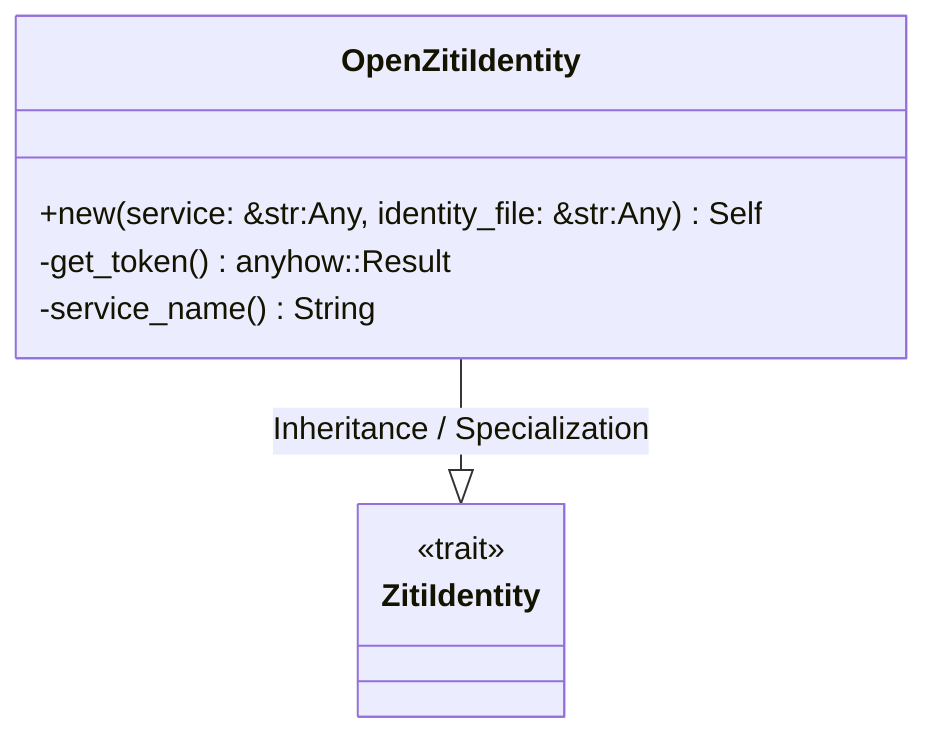
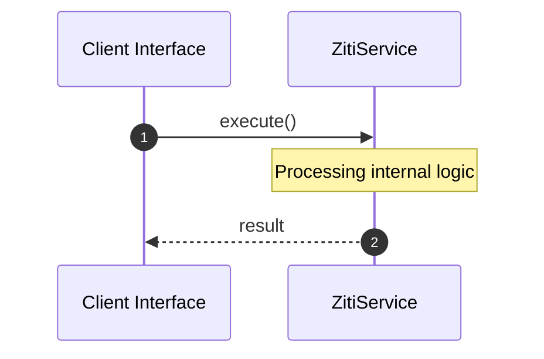

# File: ziti.rs

**Source Path:** `crates/factory-infrastructure/src/ziti.rs`

## Overview

### Purpose
Provides implementation for ziti.rs.

### Responsibilities
* Handles logic related to ziti.

### Dependencies
* super::*, async_trait::async_trait

## Public API & Architecture

### Exported Classes / Structs / Interfaces

#### ZitiIdentity

**Overview:** Represents ZitiIdentity.

**Public Methods:**

None.

#### OpenZitiIdentity

**Overview:** Represents OpenZitiIdentity.

**Public Methods:**

##### `new(service: &str (Any), identity_file: &str (Any)) -> Self`
Executes new.

### Exported Functions

None.

## Internal Architecture & Execution Flow

### Sequence Explanation

## Cross References
* **Parent module:** `crates/factory-infrastructure/src`
* **Dependencies:** super::*, async_trait::async_trait
