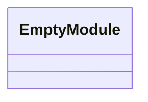
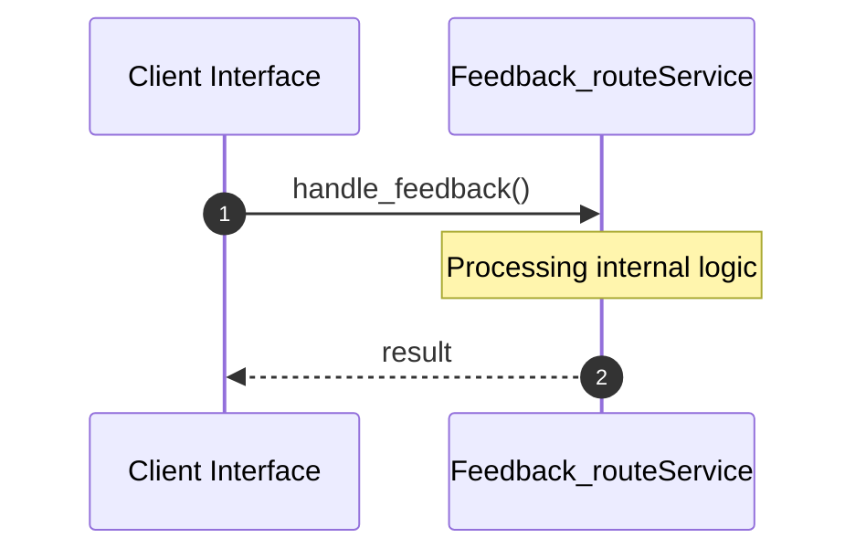

# File: feedback_route.rs

**Source Path:** `crates/factory-mcp-server/src/feedback_route.rs`

## Overview

### Purpose
Provides implementation for feedback_route.rs.

### Responsibilities
* Handles logic related to feedback_route.

### Dependencies
* factory_core::UserFeedbackPayload, std::sync::Arc, crate::McpServer, axum::{
    extract::{Json, State},
    http::StatusCode,
    response::IntoResponse,
}, factory_infrastructure::HttpGitlabClient, factory_infrastructure::GitlabClient

## Public API & Architecture

### Exported Classes / Structs / Interfaces

### Exported Functions

#### `handle_feedback(State(_server): State<Arc<McpServer>> (Any), Json(payload): Json<UserFeedbackPayload> (Any)) -> impl IntoResponse`
Executes handle_feedback.

## Internal Architecture & Execution Flow

### Sequence Explanation

## Cross References
* **Parent module:** `crates/factory-mcp-server/src`
* **Dependencies:** factory_core::UserFeedbackPayload, std::sync::Arc, crate::McpServer, axum::{
    extract::{Json, State},
    http::StatusCode,
    response::IntoResponse,
}, factory_infrastructure::HttpGitlabClient, factory_infrastructure::GitlabClient
