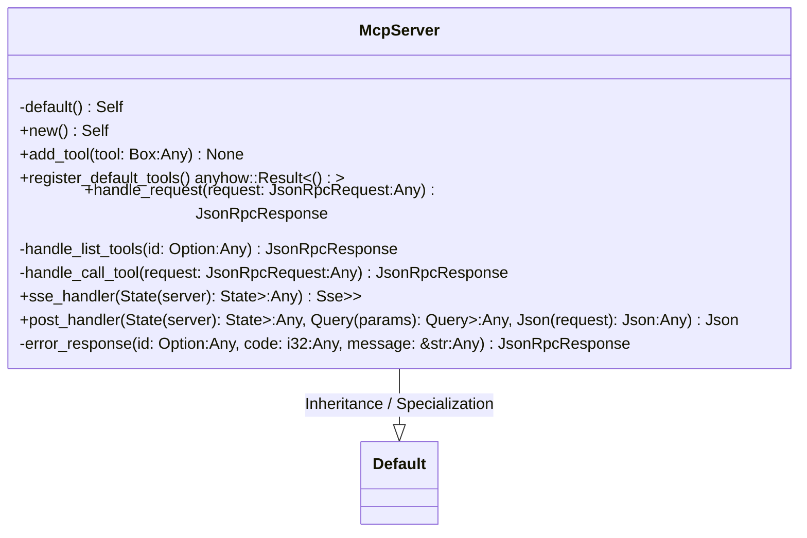
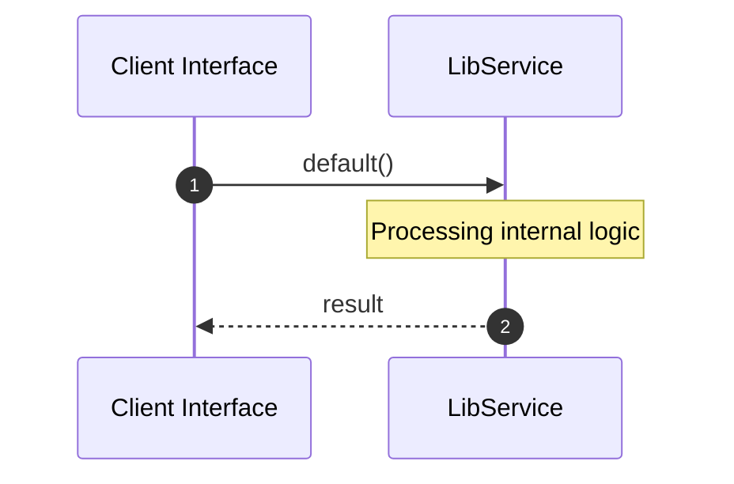

# File: lib.rs

**Source Path:** `crates/factory-mcp-server/src/lib.rs`

## Overview

### Purpose
Provides implementation for lib.rs.

### Responsibilities
* Handles logic related to lib.

### Dependencies
* crate::tools::{
            bridge::BridgeTool, execute_code::ExecuteCodeTool, index_code::IndexCodeTool,
            launch_sandbox_pod::LaunchSandboxPodTool, plan_mission::PlanMissionTool,
            retrieve_context::RetrieveContextTool, run_tests::RunTestsTool,
            search_jira::SearchJiraTool, security_review::SecurityReviewTool,
            spec_kit_tasks_to_issues::SpecKitTasksToIssuesTool, spec_kit_tool::SpecKitTool,
            update_mission_status::UpdateMissionStatusTool,
        }, crate::protocol::{JsonRpcRequest, JsonRpcResponse, McpTool}, crate::protocol::CallToolResult, tokio_stream::wrappers::UnboundedReceiverStream, crate::tools::Tool, tokio_stream::{Stream, StreamExt}, std::time::Duration, crate::tools::MockTool, std::collections::HashMap, factory_infrastructure::{HttpGitlabClient, HttpJiraClient, HttpR2rClient}, serde_json::{json, Value}, super::*, std::convert::Infallible, std::sync::Arc, axum::{
    extract::{Query, State},
    response::sse::{Event, Sse},
    Json,
}, tokio::sync::{mpsc, RwLock}

## Public API & Architecture

### Exported Classes / Structs / Interfaces

#### McpServer

**Overview:** Represents McpServer.

**Public Methods:**

##### `new() -> Self`
Executes new.

##### `add_tool(tool: Box<dyn Tool> (Any)) -> None`
Executes add_tool.

##### `register_default_tools() -> anyhow::Result<()>`
Executes register_default_tools.

##### `handle_request(request: JsonRpcRequest (Any)) -> JsonRpcResponse`
Executes handle_request.

##### `sse_handler(State(server): State<Arc<McpServer>> (Any)) -> Sse<impl Stream<Item = Result<Event, Infallible>>>`
Executes sse_handler.

##### `post_handler(State(server): State<Arc<McpServer>> (Any), Query(params): Query<HashMap<String, String>> (Any), Json(request): Json<JsonRpcRequest> (Any)) -> Json<JsonRpcResponse>`
Executes post_handler.

### Exported Functions

None.

## Internal Architecture & Execution Flow

### Sequence Explanation

## Cross References
* **Parent module:** `crates/factory-mcp-server/src`
* **Dependencies:** crate::tools::{
            bridge::BridgeTool, execute_code::ExecuteCodeTool, index_code::IndexCodeTool,
            launch_sandbox_pod::LaunchSandboxPodTool, plan_mission::PlanMissionTool,
            retrieve_context::RetrieveContextTool, run_tests::RunTestsTool,
            search_jira::SearchJiraTool, security_review::SecurityReviewTool,
            spec_kit_tasks_to_issues::SpecKitTasksToIssuesTool, spec_kit_tool::SpecKitTool,
            update_mission_status::UpdateMissionStatusTool,
        }, crate::protocol::{JsonRpcRequest, JsonRpcResponse, McpTool}, crate::protocol::CallToolResult, tokio_stream::wrappers::UnboundedReceiverStream, crate::tools::Tool, tokio_stream::{Stream, StreamExt}, std::time::Duration, crate::tools::MockTool, std::collections::HashMap, factory_infrastructure::{HttpGitlabClient, HttpJiraClient, HttpR2rClient}, serde_json::{json, Value}, super::*, std::convert::Infallible, std::sync::Arc, axum::{
    extract::{Query, State},
    response::sse::{Event, Sse},
    Json,
}, tokio::sync::{mpsc, RwLock}
