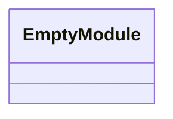
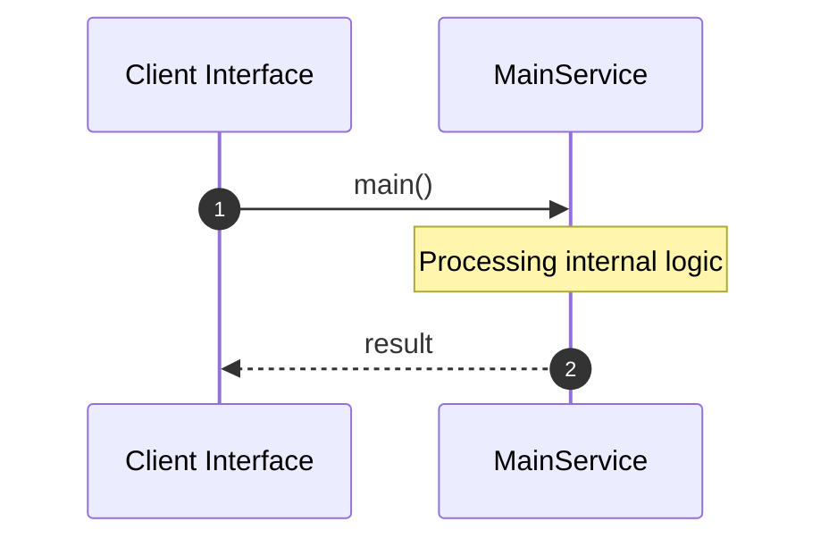

# File: main.rs

**Source Path:** `crates/factory-mcp-server/src/main.rs`

## Overview

### Purpose
Provides implementation for main.rs.

### Responsibilities
* Handles logic related to main.

### Dependencies
* factory_mcp_server::McpServer, axum::{
    routing::{get, post},
    Router,
}, std::net::SocketAddr, std::sync::Arc, tower_http::cors::CorsLayer

## Public API & Architecture

### Exported Classes / Structs / Interfaces

### Exported Functions

None.

## Internal Architecture & Execution Flow

### Sequence Explanation

## Cross References
* **Parent module:** `crates/factory-mcp-server/src`
* **Dependencies:** factory_mcp_server::McpServer, axum::{
    routing::{get, post},
    Router,
}, std::net::SocketAddr, std::sync::Arc, tower_http::cors::CorsLayer
