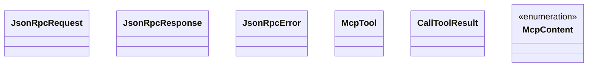
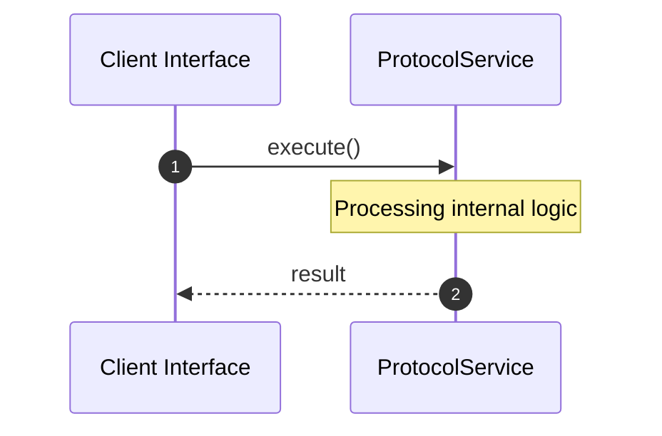

# File: protocol.rs

**Source Path:** `crates/factory-mcp-server/src/protocol.rs`

## Overview

### Purpose
Provides implementation for protocol.rs.

### Responsibilities
* Handles logic related to protocol.

### Dependencies
* serde::{Deserialize, Serialize}

## Public API & Architecture

### Exported Classes / Structs / Interfaces

#### JsonRpcRequest

**Overview:** Represents JsonRpcRequest.

**Public Methods:**

None.

#### JsonRpcResponse

**Overview:** Represents JsonRpcResponse.

**Public Methods:**

None.

#### JsonRpcError

**Overview:** Represents JsonRpcError.

**Public Methods:**

None.

#### McpTool

**Overview:** Represents McpTool.

**Public Methods:**

None.

#### CallToolResult

**Overview:** Represents CallToolResult.

**Public Methods:**

None.

#### McpContent

**Overview:** Represents McpContent.

**Public Methods:**

None.

### Exported Functions

None.

## Internal Architecture & Execution Flow

### Sequence Explanation

## Cross References
* **Parent module:** `crates/factory-mcp-server/src`
* **Dependencies:** serde::{Deserialize, Serialize}
