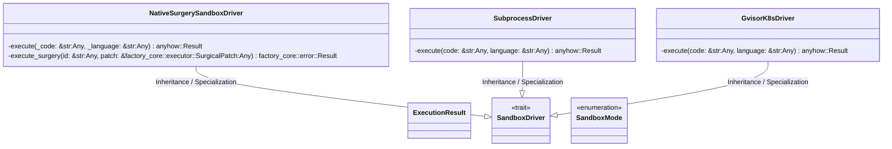
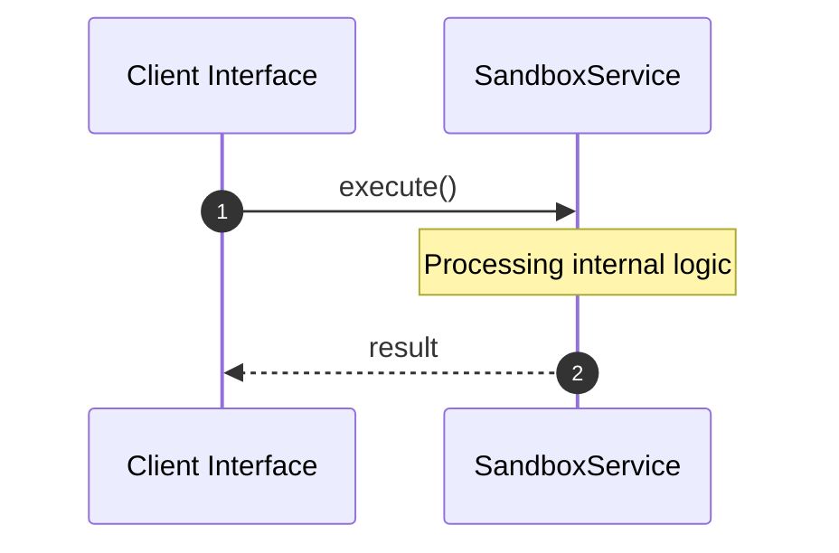

# File: sandbox.rs

**Source Path:** `crates/factory-mcp-server/src/sandbox.rs`

## Overview

### Purpose
Provides implementation for sandbox.rs.

### Responsibilities
* Handles logic related to sandbox.

### Dependencies
* serde::{Deserialize, Serialize}, serde_json::json, super::*, std::time::Duration, crate::tools::launch_sandbox_pod::LaunchSandboxPodTool, async_trait::async_trait, crate::tools::Tool, tokio::time::timeout, tokio::process::Command

## Public API & Architecture

### Exported Classes / Structs / Interfaces

#### ExecutionResult

**Overview:** Represents ExecutionResult.

**Public Methods:**

None.

#### SandboxDriver

**Overview:** Represents SandboxDriver.

**Public Methods:**

None.

#### NativeSurgerySandboxDriver

**Overview:** Represents NativeSurgerySandboxDriver.

**Public Methods:**

None.

#### SubprocessDriver

**Overview:** Represents SubprocessDriver.

**Public Methods:**

None.

#### SandboxMode

**Overview:** Represents SandboxMode.

**Public Methods:**

None.

#### GvisorK8sDriver

**Overview:** Represents GvisorK8sDriver.

**Public Methods:**

None.

### Exported Functions

None.

## Internal Architecture & Execution Flow

### Sequence Explanation

## Cross References
* **Parent module:** `crates/factory-mcp-server/src`
* **Dependencies:** serde::{Deserialize, Serialize}, serde_json::json, super::*, std::time::Duration, crate::tools::launch_sandbox_pod::LaunchSandboxPodTool, async_trait::async_trait, crate::tools::Tool, tokio::time::timeout, tokio::process::Command
