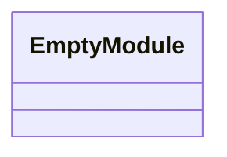
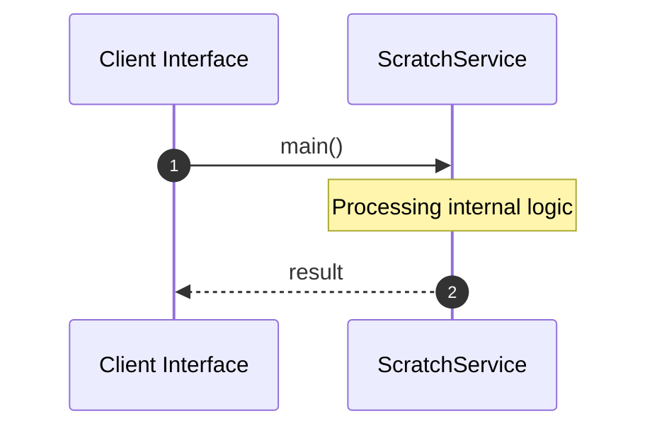

# File: scratch.rs

**Source Path:** `crates/factory-mcp-server/src/scratch.rs`

## Overview

### Purpose
Provides implementation for scratch.rs.

### Responsibilities
* Handles logic related to scratch.

### Dependencies
* reqwest::header::HeaderMap, async_openai::{Client, config::OpenAIConfig}

## Public API & Architecture

### Exported Classes / Structs / Interfaces

### Exported Functions

None.

## Internal Architecture & Execution Flow

### Sequence Explanation

## Cross References
* **Parent module:** `crates/factory-mcp-server/src`
* **Dependencies:** reqwest::header::HeaderMap, async_openai::{Client, config::OpenAIConfig}
