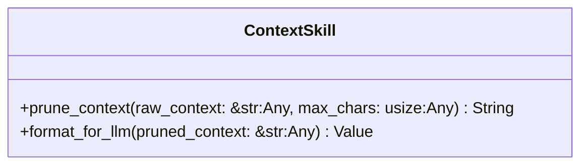
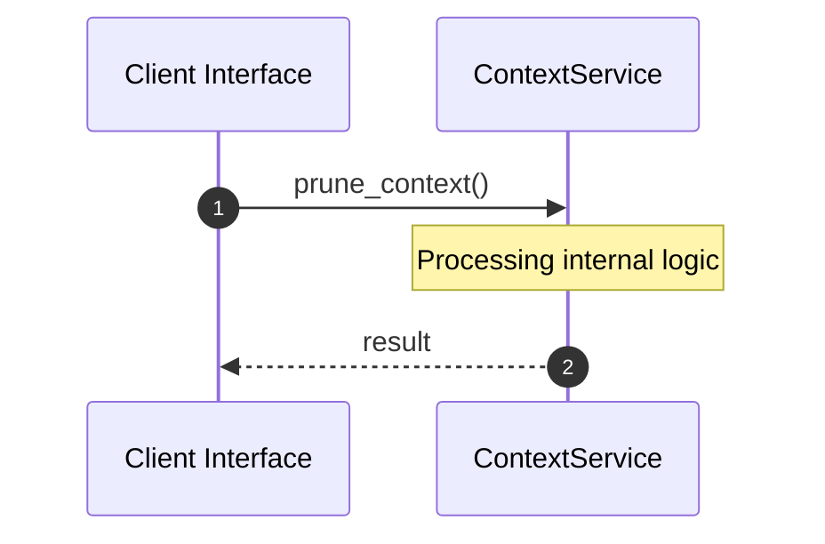

# File: context.rs

**Source Path:** `crates/factory-mcp-server/src/skills/context.rs`

## Overview

### Purpose
Provides implementation for context.rs.

### Responsibilities
* Handles logic related to context.

### Dependencies
* serde_json::{json, Value}, super::*

## Public API & Architecture

### Exported Classes / Structs / Interfaces

#### ContextSkill

**Overview:** Represents ContextSkill.

**Public Methods:**

##### `prune_context(raw_context: &str (Any), max_chars: usize (Any)) -> String`
Executes prune_context.

##### `format_for_llm(pruned_context: &str (Any)) -> Value`
Executes format_for_llm.

### Exported Functions

None.

## Internal Architecture & Execution Flow

### Sequence Explanation

## Cross References
* **Parent module:** `crates/factory-mcp-server/src/skills`
* **Dependencies:** serde_json::{json, Value}, super::*
