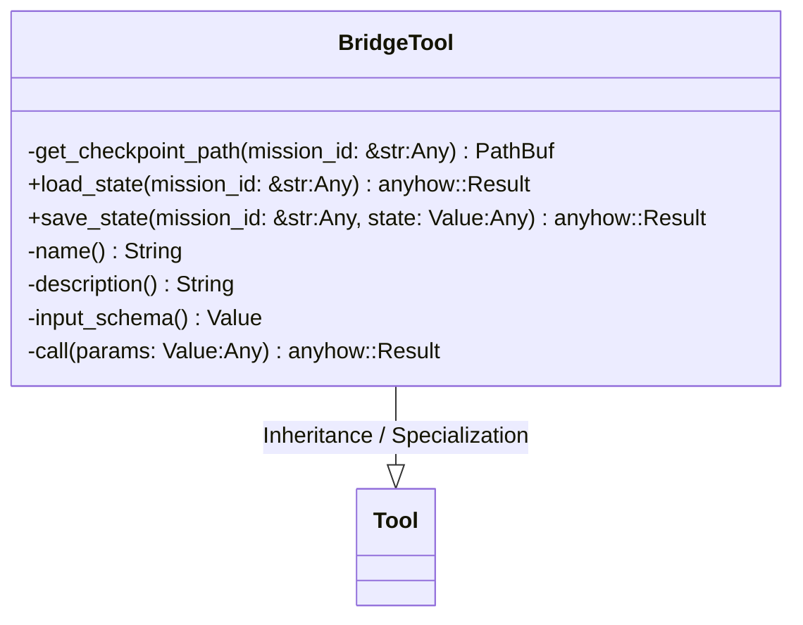
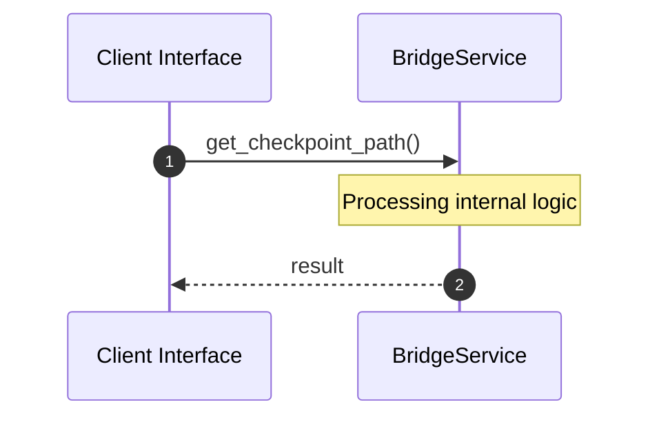

# File: bridge.rs

**Source Path:** `crates/factory-mcp-server/src/tools/bridge.rs`

## Overview

### Purpose
Provides implementation for bridge.rs.

### Responsibilities
* Handles logic related to bridge.

### Dependencies
* std::fs, crate::protocol::CallToolResult, serde_json::{json, Value}, std::path::PathBuf, crate::tools::Tool, async_trait::async_trait

## Public API & Architecture

### Exported Classes / Structs / Interfaces

#### BridgeTool

**Overview:** Represents BridgeTool.

**Public Methods:**

##### `load_state(mission_id: &str (Any)) -> anyhow::Result<Value>`
Executes load_state.

##### `save_state(mission_id: &str (Any), state: Value (Any)) -> anyhow::Result<Value>`
Executes save_state.

### Exported Functions

None.

## Internal Architecture & Execution Flow

### Sequence Explanation

## Cross References
* **Parent module:** `crates/factory-mcp-server/src/tools`
* **Dependencies:** std::fs, crate::protocol::CallToolResult, serde_json::{json, Value}, std::path::PathBuf, crate::tools::Tool, async_trait::async_trait
