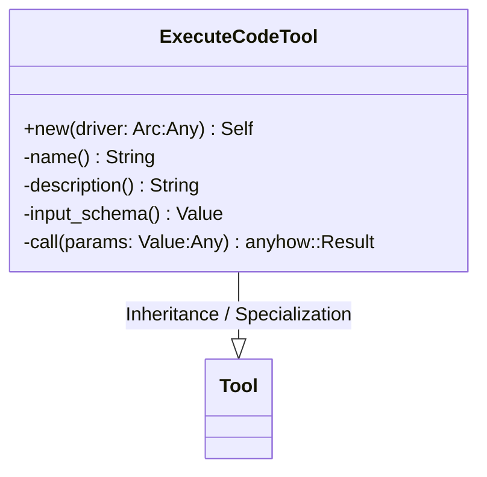
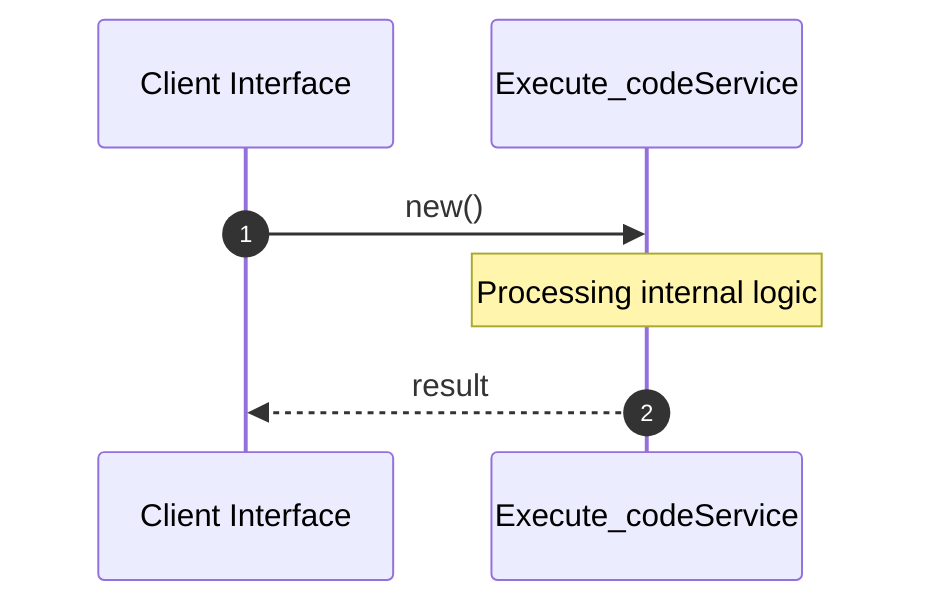

# File: execute_code.rs

**Source Path:** `crates/factory-mcp-server/src/tools/execute_code.rs`

## Overview

### Purpose
Provides implementation for execute_code.rs.

### Responsibilities
* Handles logic related to execute_code.

### Dependencies
* crate::sandbox::SandboxDriver, serde_json::{json, Value}, crate::protocol::{CallToolResult, McpContent}, crate::tools::Tool, std::sync::Arc, async_trait::async_trait

## Public API & Architecture

### Exported Classes / Structs / Interfaces

#### ExecuteCodeTool

**Overview:** Represents ExecuteCodeTool.

**Public Methods:**

##### `new(driver: Arc<dyn SandboxDriver> (Any)) -> Self`
Executes new.

### Exported Functions

None.

## Internal Architecture & Execution Flow

### Sequence Explanation

## Cross References
* **Parent module:** `crates/factory-mcp-server/src/tools`
* **Dependencies:** crate::sandbox::SandboxDriver, serde_json::{json, Value}, crate::protocol::{CallToolResult, McpContent}, crate::tools::Tool, std::sync::Arc, async_trait::async_trait
