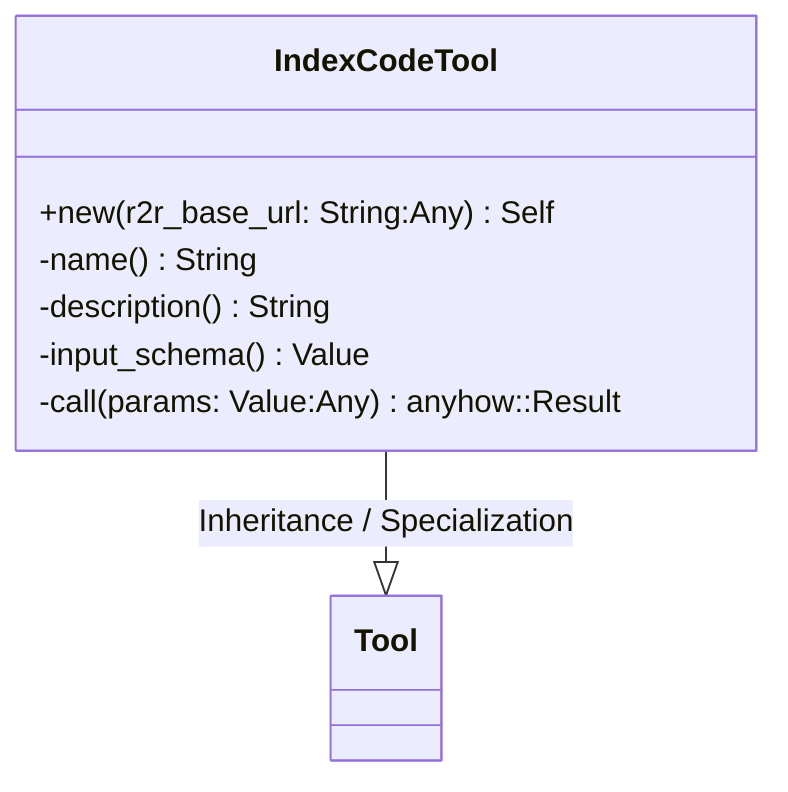
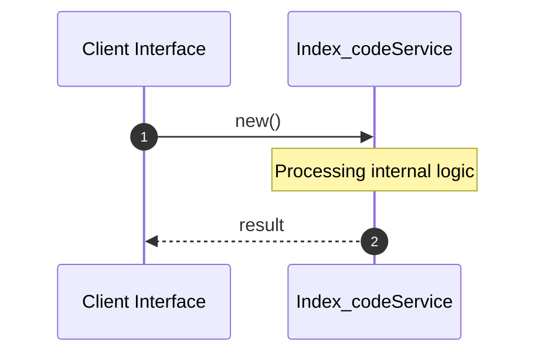

# File: index_code.rs

**Source Path:** `crates/factory-mcp-server/src/tools/index_code.rs`

## Overview

### Purpose
Provides implementation for index_code.rs.

### Responsibilities
* Handles logic related to index_code.

### Dependencies
* super::*, serde_json::{json, Value}, crate::tools::Tool, crate::protocol::{CallToolResult, McpContent}, async_trait::async_trait

## Public API & Architecture

### Exported Classes / Structs / Interfaces

#### IndexCodeTool

**Overview:** Represents IndexCodeTool.

**Public Methods:**

##### `new(r2r_base_url: String (Any)) -> Self`
Executes new.

### Exported Functions

None.

## Internal Architecture & Execution Flow

### Sequence Explanation

## Cross References
* **Parent module:** `crates/factory-mcp-server/src/tools`
* **Dependencies:** super::*, serde_json::{json, Value}, crate::tools::Tool, crate::protocol::{CallToolResult, McpContent}, async_trait::async_trait
