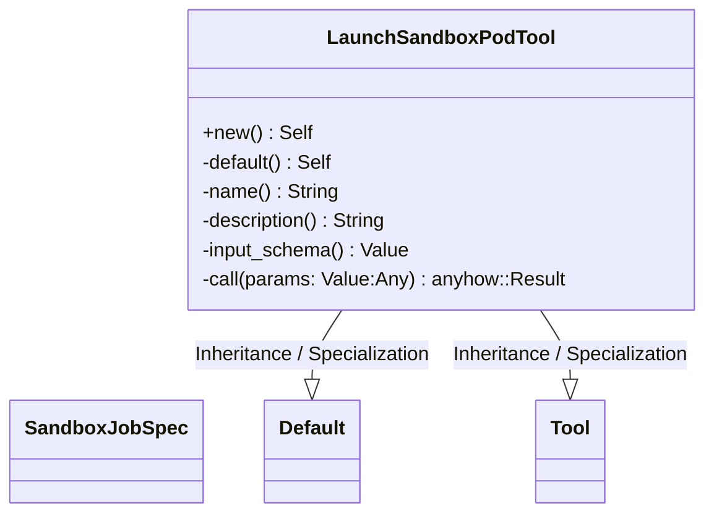
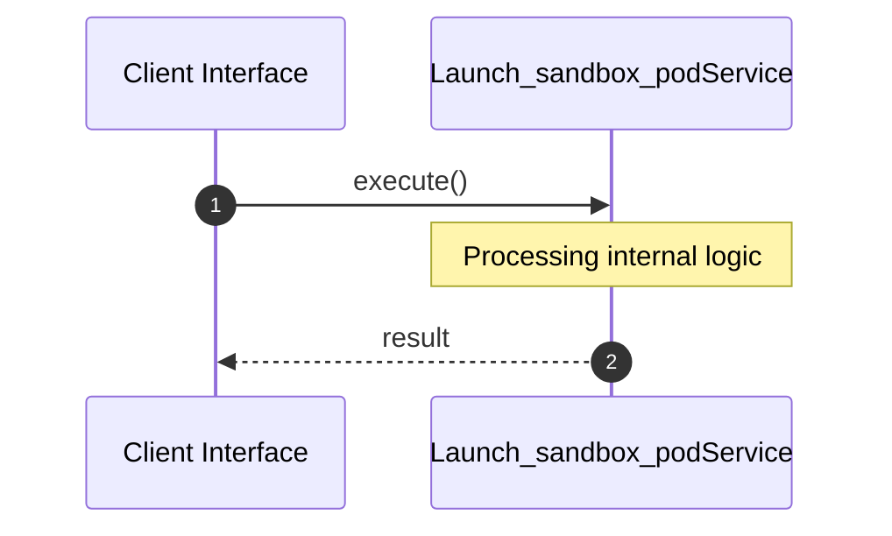

# File: launch_sandbox_pod.rs

**Source Path:** `crates/factory-mcp-server/src/tools/launch_sandbox_pod.rs`

## Overview

### Purpose
Provides implementation for launch_sandbox_pod.rs.

### Responsibilities
* Handles logic related to launch_sandbox_pod.

### Dependencies
* serde_json::{json, Value}, k8s_openapi::api::batch::v1::Job, kube::api::{Api, DeleteParams, ListParams, PostParams}, serde::{Deserialize, Serialize}, crate::protocol::{CallToolResult, McpContent}, tokio::time::{sleep, Duration}, kube::Client, async_trait::async_trait, crate::tools::Tool

## Public API & Architecture

### Exported Classes / Structs / Interfaces

#### SandboxJobSpec

**Overview:** Represents SandboxJobSpec.

**Public Methods:**

None.

#### LaunchSandboxPodTool

**Overview:** Represents LaunchSandboxPodTool.

**Public Methods:**

##### `new() -> Self`
Executes new.

### Exported Functions

None.

## Internal Architecture & Execution Flow

### Sequence Explanation

## Cross References
* **Parent module:** `crates/factory-mcp-server/src/tools`
* **Dependencies:** serde_json::{json, Value}, k8s_openapi::api::batch::v1::Job, kube::api::{Api, DeleteParams, ListParams, PostParams}, serde::{Deserialize, Serialize}, crate::protocol::{CallToolResult, McpContent}, tokio::time::{sleep, Duration}, kube::Client, async_trait::async_trait, crate::tools::Tool
