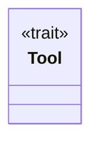
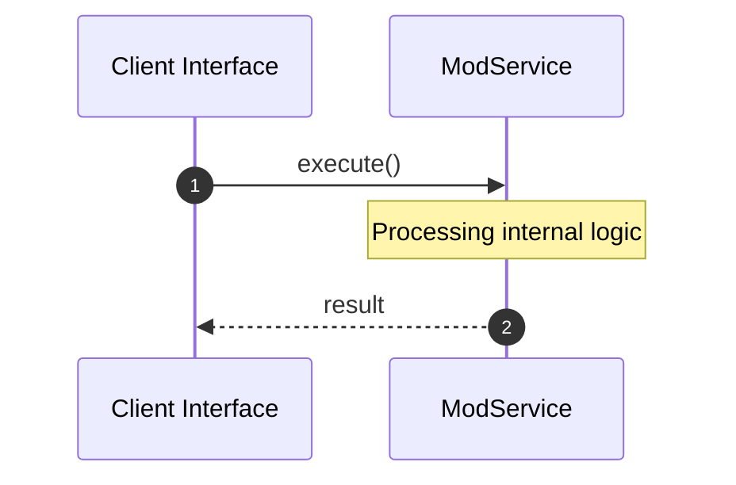

# File: mod.rs

**Source Path:** `crates/factory-mcp-server/src/tools/mod.rs`

## Overview

### Purpose
Provides implementation for mod.rs.

### Responsibilities
* Handles logic related to mod.

### Dependencies
* pub execute_code::ExecuteCodeTool, async_trait::async_trait, pub security_review::SecurityReviewTool, pub index_code::IndexCodeTool, pub launch_sandbox_pod::LaunchSandboxPodTool, serde_json::Value, pub spec_kit_tasks_to_issues::SpecKitTasksToIssuesTool, pub search_jira::SearchJiraTool, crate::protocol::CallToolResult, pub run_tests::RunTestsTool, pub update_mission_status::UpdateMissionStatusTool, pub plan_mission::PlanMissionTool, pub spec_kit_tool::SpecKitTool, pub retrieve_context::RetrieveContextTool, pub bridge::BridgeTool

## Public API & Architecture

### Exported Classes / Structs / Interfaces

#### Tool

**Overview:** Represents Tool.

**Public Methods:**

None.

### Exported Functions

None.

## Internal Architecture & Execution Flow

### Sequence Explanation

## Cross References
* **Parent module:** `crates/factory-mcp-server/src/tools`
* **Dependencies:** pub execute_code::ExecuteCodeTool, async_trait::async_trait, pub security_review::SecurityReviewTool, pub index_code::IndexCodeTool, pub launch_sandbox_pod::LaunchSandboxPodTool, serde_json::Value, pub spec_kit_tasks_to_issues::SpecKitTasksToIssuesTool, pub search_jira::SearchJiraTool, crate::protocol::CallToolResult, pub run_tests::RunTestsTool, pub update_mission_status::UpdateMissionStatusTool, pub plan_mission::PlanMissionTool, pub spec_kit_tool::SpecKitTool, pub retrieve_context::RetrieveContextTool, pub bridge::BridgeTool
