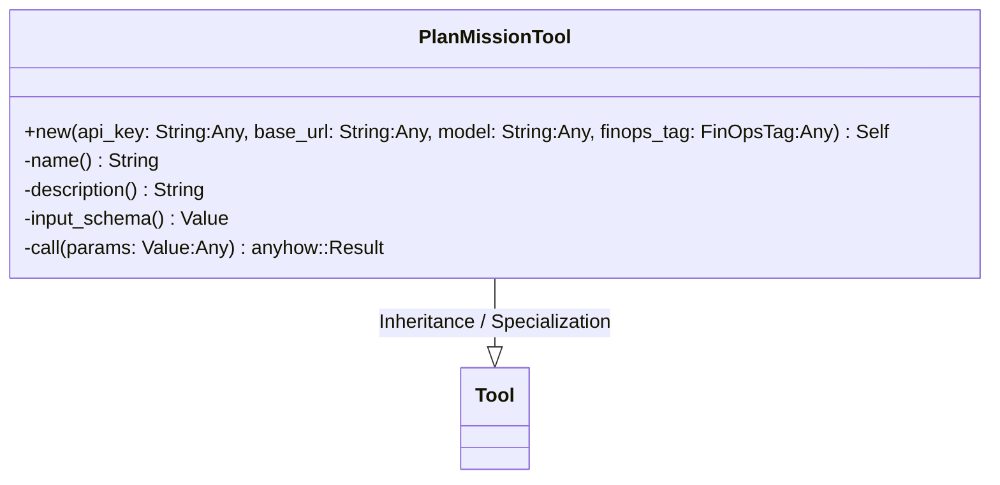
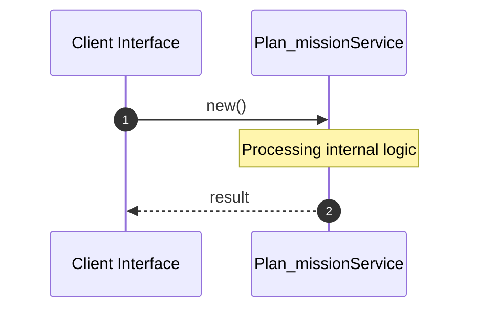

# File: plan_mission.rs

**Source Path:** `crates/factory-mcp-server/src/tools/plan_mission.rs`

## Overview

### Purpose
Provides implementation for plan_mission.rs.

### Responsibilities
* Handles logic related to plan_mission.

### Dependencies
* factory_core::FinOpsTag, async_trait::async_trait, crate::tools::Tool, serde_json::{json, Value}, async_openai::{
    types::{
        ChatCompletionRequestSystemMessageArgs, ChatCompletionRequestUserMessageArgs,
        ChatCompletionResponseFormat, ChatCompletionResponseFormatType,
        CreateChatCompletionRequestArgs,
    },
    Client,
}, crate::protocol::{CallToolResult, McpContent}, reqwest::header::{HeaderMap, HeaderValue}

## Public API & Architecture

### Exported Classes / Structs / Interfaces

#### PlanMissionTool

**Overview:** Represents PlanMissionTool.

**Public Methods:**

##### `new(api_key: String (Any), base_url: String (Any), model: String (Any), finops_tag: FinOpsTag (Any)) -> Self`
Executes new.

### Exported Functions

None.

## Internal Architecture & Execution Flow

### Sequence Explanation

## Cross References
* **Parent module:** `crates/factory-mcp-server/src/tools`
* **Dependencies:** factory_core::FinOpsTag, async_trait::async_trait, crate::tools::Tool, serde_json::{json, Value}, async_openai::{
    types::{
        ChatCompletionRequestSystemMessageArgs, ChatCompletionRequestUserMessageArgs,
        ChatCompletionResponseFormat, ChatCompletionResponseFormatType,
        CreateChatCompletionRequestArgs,
    },
    Client,
}, crate::protocol::{CallToolResult, McpContent}, reqwest::header::{HeaderMap, HeaderValue}
