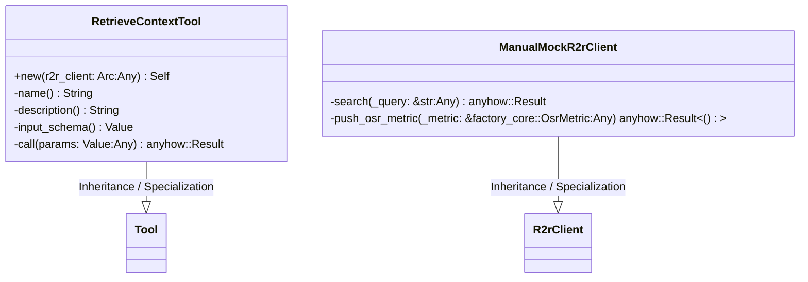
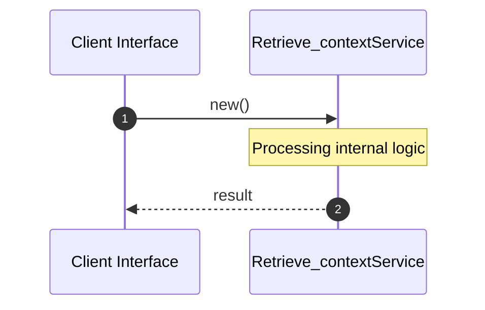

# File: retrieve_context.rs

**Source Path:** `crates/factory-mcp-server/src/tools/retrieve_context.rs`

## Overview

### Purpose
Provides implementation for retrieve_context.rs.

### Responsibilities
* Handles logic related to retrieve_context.

### Dependencies
* serde_json::{json, Value}, crate::protocol::{CallToolResult, McpContent}, super::*, std::sync::Arc, factory_infrastructure::R2rClient, async_trait::async_trait, crate::tools::Tool

## Public API & Architecture

### Exported Classes / Structs / Interfaces

#### RetrieveContextTool

**Overview:** Represents RetrieveContextTool.

**Public Methods:**

##### `new(r2r_client: Arc<dyn R2rClient> (Any)) -> Self`
Executes new.

#### ManualMockR2rClient

**Overview:** Represents ManualMockR2rClient.

**Public Methods:**

None.

### Exported Functions

None.

## Internal Architecture & Execution Flow

### Sequence Explanation

## Cross References
* **Parent module:** `crates/factory-mcp-server/src/tools`
* **Dependencies:** serde_json::{json, Value}, crate::protocol::{CallToolResult, McpContent}, super::*, std::sync::Arc, factory_infrastructure::R2rClient, async_trait::async_trait, crate::tools::Tool
