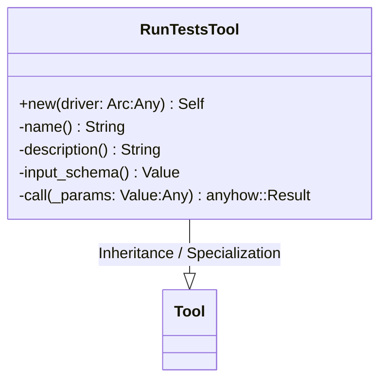
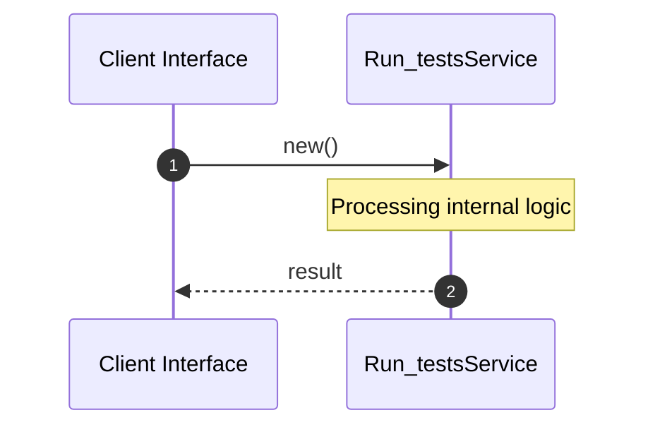

# File: run_tests.rs

**Source Path:** `crates/factory-mcp-server/src/tools/run_tests.rs`

## Overview

### Purpose
Provides implementation for run_tests.rs.

### Responsibilities
* Handles logic related to run_tests.

### Dependencies
* crate::protocol::{CallToolResult, McpContent}, crate::sandbox::SandboxDriver, async_trait::async_trait, serde_json::{json, Value}, std::sync::Arc, crate::tools::Tool

## Public API & Architecture

### Exported Classes / Structs / Interfaces

#### RunTestsTool

**Overview:** Represents RunTestsTool.

**Public Methods:**

##### `new(driver: Arc<dyn SandboxDriver> (Any)) -> Self`
Executes new.

### Exported Functions

None.

## Internal Architecture & Execution Flow

### Sequence Explanation

## Cross References
* **Parent module:** `crates/factory-mcp-server/src/tools`
* **Dependencies:** crate::protocol::{CallToolResult, McpContent}, crate::sandbox::SandboxDriver, async_trait::async_trait, serde_json::{json, Value}, std::sync::Arc, crate::tools::Tool
